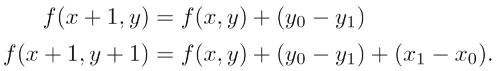

# 计算机图形学三：直线光栅化的数值微分算法,中点Brensenham算法和三角形的光栅化

## **直线与三角形的光栅化算法**

在进入具体的直线光栅化以及三角形光栅化算法之前，我们首先需要知道光栅化是一个什么样的过程。简单来说光栅化的目的就是将想要展现的物体给真正现实到屏幕上的过程，因为我们的物体其实都是一个个顶点数据来表示的，如何表这些蕴含几何信息的数据转化为屏幕上的像素就是光栅化所考虑的东西。比如说一条直线，究竟该用哪些像素点去逼近它，一个三角形，又用哪些像素集合表示它，这都是光栅化的过程。本节主要讨论介绍两个直线光栅化和一个三角形光栅化算法。

## **1 屏幕像素的表示**

屏幕中的每一个像素点我们都用整数坐标进行表示，最大最小值与分辨率相对应，考虑到每个像素都有一定的面积，我们定义(x+0.5,y+0.5)为该(x,y)像素的中心，如图中黑圈所示。

## **2 直线光栅化算法**

## **2.1 DDA数值微分算法**

DDA算法是一个非常简单直观的算法。 首先当任何一条直线知道任意两点时都可以用$y=kx+b$来表示，其中k代表斜率，如果$|k|<1$，那么它的主要行进方向就是x轴，即x轴的变化要比y轴快，相反如果如果$|k|>1$，那么它的主要行进方向就是y轴，即y轴的变化要比x轴快。如下图所示：

我们分别就图上两种情况进行考虑(假设起点与终点给定(确定了直线方程)，就像图中一样)

**1 当|k|<1时，从起点开始画起每次x = x+1， y = y+k, 并将y四舍五入，得到新的x，y就是像素点应该画的地方**

**2 当|k|>1时，从起点开始画起每次y = y+1， x = x+1/k, 并将x四舍五入，得到新的x，y就是像素点应该画的地方**

图中的两种情况的光栅化结果也已给出供参考。

## **2.2 中点Bresenham算法**

我们首先规定想要光栅化的线段的起点$P_0(x_0,y_0)$与终点$P_1(x_1,y_1)$,则该直线方程可以用$y = k_x + b$的形式来表示，定义$f(x,y)=y−k_x−b$, 准备工作完成之后，接下来一起看看bresenham算法的具体过程！

中点Bresenham算法的思想其实也比较简单，我们在这里只给出0<k<1 的情况，其它情况可以类推，除却起点与终点，我们每次的画点只会考虑右边或者右上的点两种情况(由斜率所决定的)，因此我们只需要在这二者之间做出选择。那么该依据什么进行判断呢，给出如下两种情况，第一：

我们已经成功画出了前三个蓝色方格之后，所要考虑的便是第三个蓝色方格右边或者右上的橙色方格，此时我们取这两个橙色方格的中点，如图中圆圈符号所对应的那个点，倘若这个点在直线方程的下面，那么很明显我们应该选择右上的方格。

第二种情况：

此时中点位于直线方程的上方，此时选择右边的橙色方格。

至此，如何判断两种方格选择的条件已很明显，就是确定中点与直线的位置关系，这里就可以使用到一开始定义的f(x,y)=y−kx−b的方程了。

**显然，当f(x+1,y+0.5) > 0的时候中点在直线上方，当f(x+1,y+0.5) < 0的时候中点在直线下方 （其中x+1，y+0.5是为了表示两个橙色方格的中点，此时x，y为前一个确定的像素坐标）**

伪代码如下：

其中的，some condition也就很明显的是

目前为止，算法整体便已完成，但有一个问题是，我们每次都要进行一次F（x，y）的计算，倘若直线方程比较复杂，这是很消耗资源的(因为在底层可能是几百万次的重复调用)。因此一种改进方法便是利用增量算法。不难具体算出f(x,y)方程具体如下：

观察可以得出

那么算法只需要算出第一次的 f(x+1,y+0.5) ，之后的每次只需根据上述式子进行相应增量计算即可，如下：

如果还有不解，不妨具体的取两个点推一边算法便可加深理解。 当然中点bresenham算法其实还在这之上进一步做了一步优化，因为第一个d其中存在浮点数0.5,所以将有关d的等式两边都乘以2，消除了该0.5的浮点，增加了计算效率。

## **3 三角形光栅化算法**

有读者可能会疑问，为什么不讲四边形五边形的光栅化算法，偏偏要谈三角形呢，因为三角形是最基本的多边形，大部分的模型都是用一个个三角形面表示，且任意的其它多边形其实都可以转化成多个三角形的形式，因此三角形的光栅化可以说是图形学中最基础的部分了。那么该怎么去做呢？

其实有一个非常直观的做法，我们对屏幕中的每一个像素进行采样，如果这个像素点在三角形之中那么这个像素点就应该被采用！对，这其实就是该算法的做法。那么该如何去判断一个点在不在三角形内部呢，那么其中一种办法就是利用叉乘的性质了

如图所示，我们事先知道想要光栅化的三角形的三个顶点$P_0，P_1，P_2$，以及检测点Q。 只要分别计算$ P_0P_1×P_0Q，P_1P_2×P_1Q，P_2P_0×P_2Q$,如果三者同号则代表点P在三条线段的同一边，那么必然处于三角形内部，如果不同号则代表该点一定在三角形外部！

因此自然的，只需要遍历每一个点就可以得出三角形的光栅化结果了！当然我们还可以进一步的进行优化，因为显然并没有必要去测试屏幕中的每一个点，一个三角形面可能只占屏幕很小的部分，可以利用一个bouding box 包围住想要测试的三角形，只对该bounding box内的点进行采样测试，如下图：

这样就可以得到很大的效率提升了！