# 计算机图形学九：隐式曲面(代数形式,CSG, 距离函数,分型几何)与显式曲面

## **隐式曲面与显式曲面**

几何形体是计算机图形学当中十分重要的一部分内容，无论是人物，风景，建筑，都离不开几何，如何表示好各种各样的模型是几何部分的主要研究内容之一。本篇笔记是系列笔记的第九篇，作为几何部分的第一次笔记会主要介绍隐式曲面和显式曲面的特点，以及二者分类之下各自主要的几何表现形式。

## **1 隐式曲面(Implicit Surface)与显示曲面(Explicit Surface)的特点**

在进入具体讲解之前，先放轻松一起看看几个几何的例子。

水杯:

水滴:

建筑群:

在见过这些各式各样的几何形体之后，为了进行更进一步的分类，我们首先把几何分为两大类别即隐式与显式。

## **1.1 隐式曲面的特点**

所谓隐式曲面指的是并不会告诉你任何点的信息，只会告诉你该曲面上所有点满足的关系。来举个具体的隐式曲面的例子:

$x^2+y^2+z^2=1$

相信读者都能一眼看出来这是一个3维球体的方程，一般地的我们会把隐式曲面的代数方程写作$f(x,y,z)=0$，该球体的$f(x,y,z)=x^2+y^2+z^2−1$。

对于隐式方程来说因为没有给出任何点的信息，因此如何采样到曲面上具体的点是一个很难的问题，如下图这样一个例子:

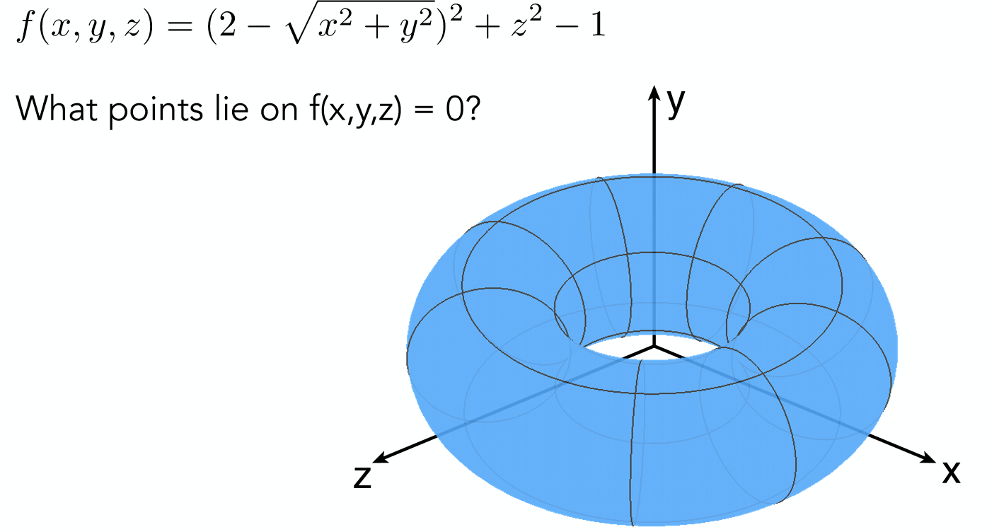

别说找出这样一个圆环上的点了，相信不少人都像作者一样，第一眼见到这个代数方程之后连他表现的形状是什么都不知道。

考虑到事物的两面性，有它的坏处自然也就有它的好处：

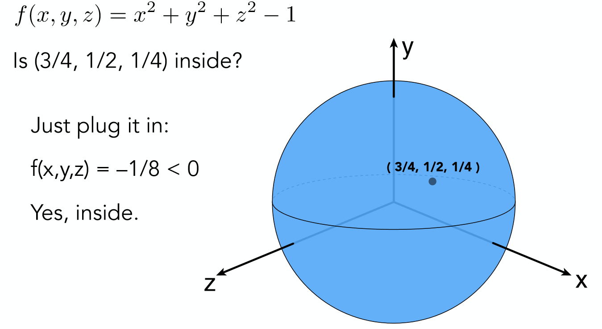

如果使用隐式曲面方程，将会十分容易的判断出一点与曲面的关系，这是一种非常具有吸引力的特性(能够轻易的判定光线与物体是否相交)。

对于其他具体的隐式曲面稍后再做介绍，首先来看看与之相对的显式曲面的特点。

## **1.2 显式曲面的特点**

对于显式曲面来说是与隐式曲面相对应的，所有曲面的点被直接给出，或者可以通过映射关系直接得到，如下图:

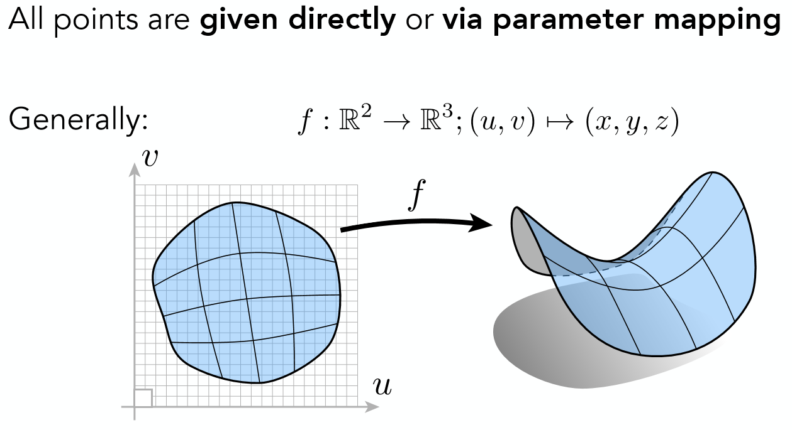

虽然没有直接给出点的数据x，y，z，但是拥有u，v的取值范围以及从$(u,v)→(x,y,z)$的映射关系，那么只需要将所有的u，v代入自然就可求得x，y，z。

**区别隐式曲面与显示曲面的关键就在于是否可以直接表示出所有的点**

在1.1节提到了隐式曲面难以采样曲面上的点，但是可以轻易判断点与曲面的关系，对于显式曲面来说恰恰相反，我们可以很轻易的采样到所有的点，但是给予你任意一点却很难判断它与曲面的关系！

**因此没有哪一种的几何表现方式是更好的，根据具体的任务来选择隐式还是显式才是合理的做法。**

## **2 具体的几种隐式曲面**

## **2.1 代数曲面(Algebraic Surfaces)**

对于该类隐式曲面来说其实正是在第一章中举例说明所运用到的，通过代数表达式可以得到许许多多不同的几何曲面:

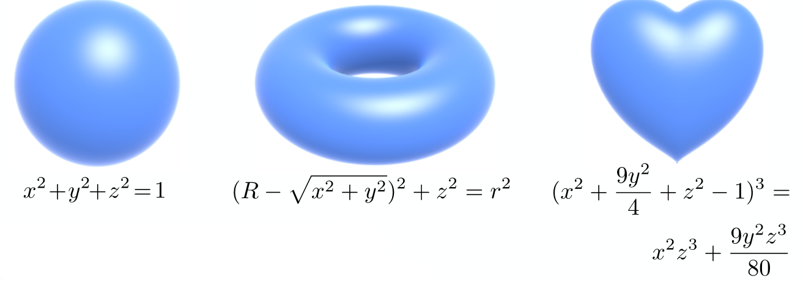

但似乎单纯代数表达式的曲面都颇具有规则性，那么对于更复杂的几何形体怎么办呢？ CSG(不知道这个怎么翻译才比较好,就直接用英文代替了)便应运而生了。

## **2.2 Constructive Solid Geometry(CSG)**

CSG指的是可以对各种不同的几何做布尔运算，如并，交，差：

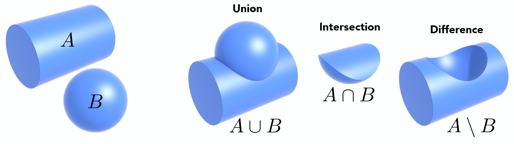

通过这些操作可以得出各种更为复杂的几何:

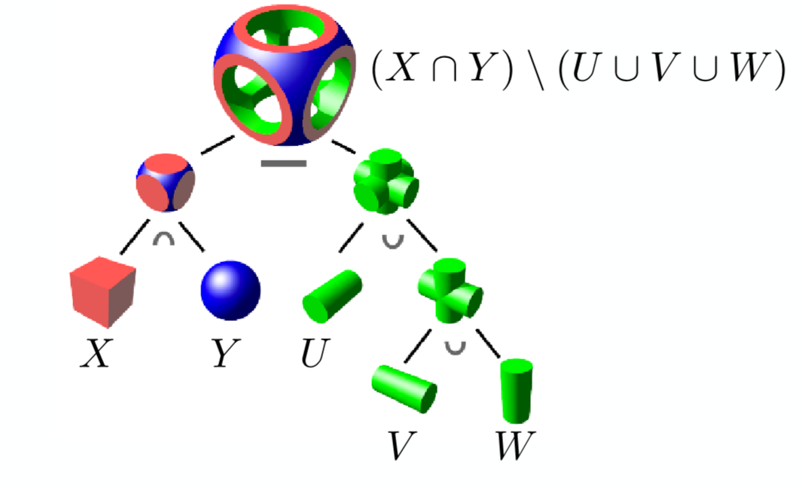

通过CSG的方法可以一定程度上缓解隐式曲面难以表现复杂形体的困境。 (该种方法广泛存在于各类建模软件之中)

## **2.3 符号距离函数(Signed Distance Function)**

除了对于几何的布尔操作，还可以通过距离函数来得到几何形体混合的效果，如下图:

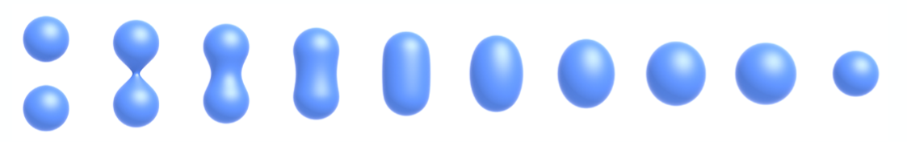

如何得到这种blend的效果，就要从SDF即符号距离函数说起了(这里的符号是指距离可以有正有负)。

首先对于符号距离函数来说本质上就是一种定义距离的函数。如有空间任意一点到各个几何物体表面的距离，对这些距离做各种各样的运算操作最后得到的一个函数就是最终的距离函数了，举一个简单的例子:

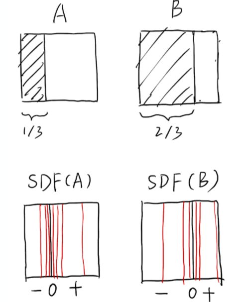

对于这样一个二维平面的例子，定义空间中每一个点的SDF为该点到阴影区域右边界的垂直距离，在阴影内部为负，外部为正，因此对于A和B两种阴影来说的SDF分别如上图下半部分所示。有了SDF(A)，SDF(B)之后对这两个距离函数选择性的做一些运算得到最终的距离函数，这里采用最简单的$SDF = SDF(A)+SDF(B)$来举例，最终得到的SDF为零的点的集合即为blend之后曲面，对该例子来说，就是两道阴影之间中点的一条线:

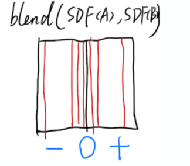

因此对于一开始的那个例子来说，只需合理定义空间中任意一个点的SDF，再令SDF为0即可得到混合的效果了。

(tips:对于几何体混合效果自然不可能像这里简单的两个距离相加就可以得到了，该效果具体实现是找出任一个点到两个几何体表面距离中的最短距离再减去一个变量作为该点最终的SDF，有兴趣的读者可以取油管搜索Coding Adventure:Ray Marching,该视频的讲解很不错)

## **2.4 水平集(Level Set)**

水平集的方法其实与SDF很像(像是SDF的一种特殊形式)，也是找出函数值为0的地方作为曲线，但不像SDF会空间中的每一个点有一种严格的数学定义，而是对空间用一个个格子去近似一个函数，如下:

对该面内的每一个点利用已经定义好的格子值进行双线性插值(在纹理映射一节已讲解)就可以得到任意一点的函数值，找出所有=0的点作为曲面。

该方法的好处是对于SDF，我们可以更加显示的区空间曲线的形状。该方法广泛的运用在医学成像和物理模拟之中:

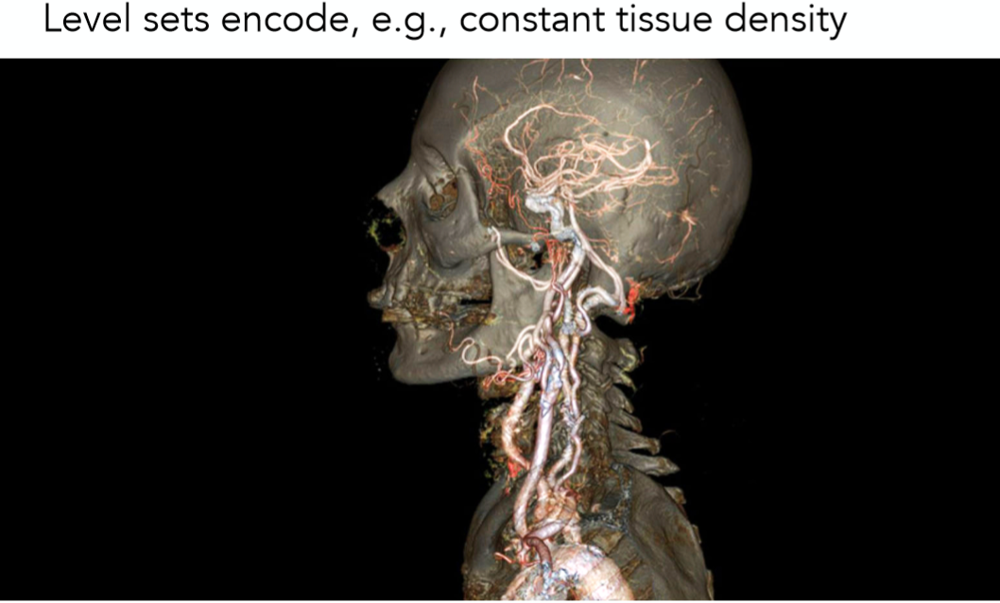

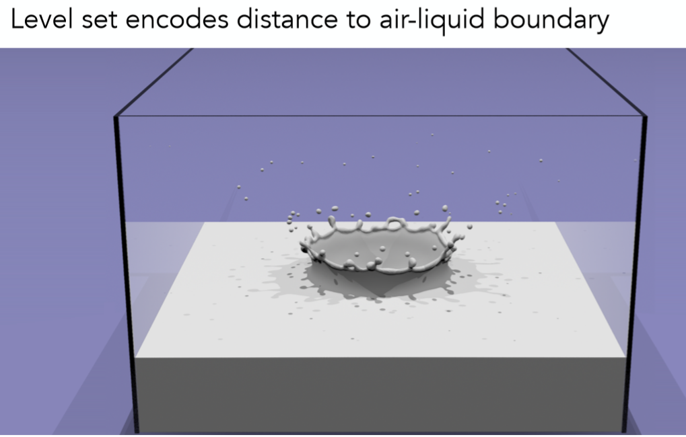

## **2.5 分型几何(Fractals)**

分型几何是指许许多多自相似的形体最终所组成的几何形状。

如雪花是一个六边形，放大之后会发现每一个边上又是一个六边形，再放大六边形边上的六边形边上又是六边形，就这样无限套娃，有点递归的意思。

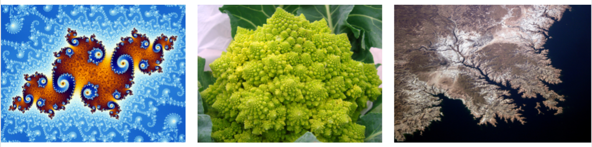

以上就是对隐式曲面的具体例子的一些介绍了，总的来说隐式曲面具有形式简单，轻易判断点与曲面关系等优点，但难以采样曲面点和模拟过于复杂的形状。

接下来看看显示曲面。

## **3 具体的几种显式曲面**

首先，同样在第一章中所用的类似参数方程的方法间接得到所有点坐标的方法是一种显示曲面的类型(贝塞尔曲线以及贝塞尔曲面可以归结在这一类，但是二者较为复杂会放到下一篇笔记讲解)，除了该种方法，看看还有什么显示曲面的类型呢？

## **3.1 点云(Point Cloud)**

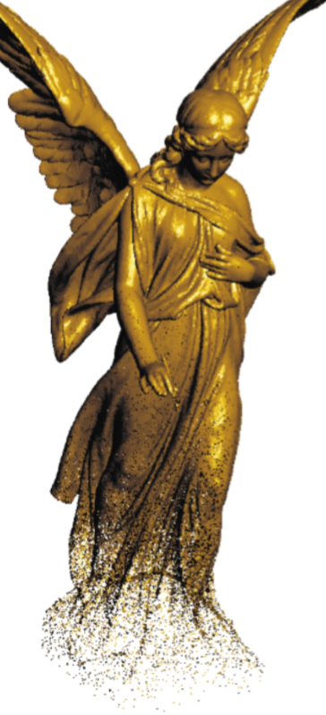

顾名思义，就是很多很多的点构成的曲面，直接有着所有点的信息，没什么太多可讲的，多过点多模型细节就多，点少模型细节就少。一个3维的坐标列表

## **3.2 多边形网格(Polygon Mesh)**

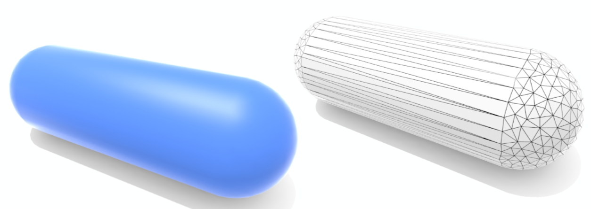

对于多边形网格来说相信读者并不陌生，该方法广泛应用在计算机图形当中，简单来说通过定义各个多边形面的顶点以及顶点之间的连接关系就可以得到许许多多的三角形面或是四边形面，再通过这些面来近似表现出我们想要的模型效果。

例如比较著名的.obj文件，其格式如下

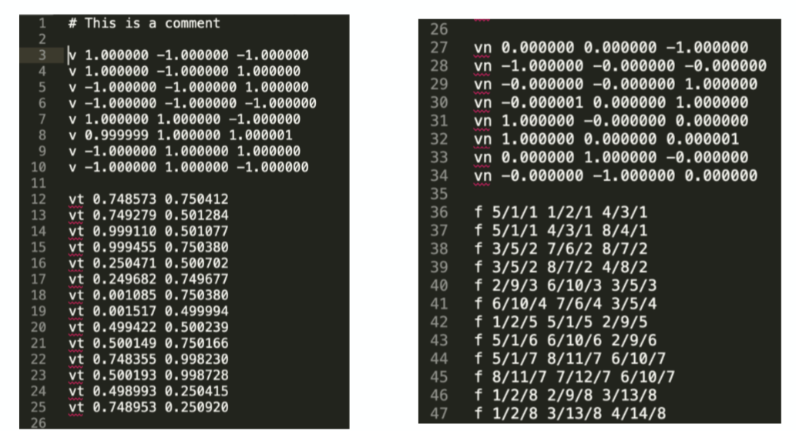

这是一个立方体的模型数据例子。

3-10行定义了立方体的8个顶点信息。 12-25行定义了这些顶点的纹理坐标信息(每个面4个点，共6个面所以最多有24种不同的纹理坐标信息，这里有一些纹理对于不同面上的点是公用的)。 27-34行定义了6个面的法线信息，为什么有8个是因为建模软件输出的精度问题不必在意，其中有两个是重复的。

最重要的就是36-47行了，f 代表一个面，其中x/x/x的第一位表示是哪个顶点，第二位表示该顶点纹理坐标是第几个，第三位表示法线信息是第几个。 3个 x/x/x表示3个顶点的信息构成一个面。

## **总结**

以上就是对几何的一些基础知识的讲解了，下一节会具体介绍显式曲面中的贝塞尔曲线以及贝塞尔曲面。