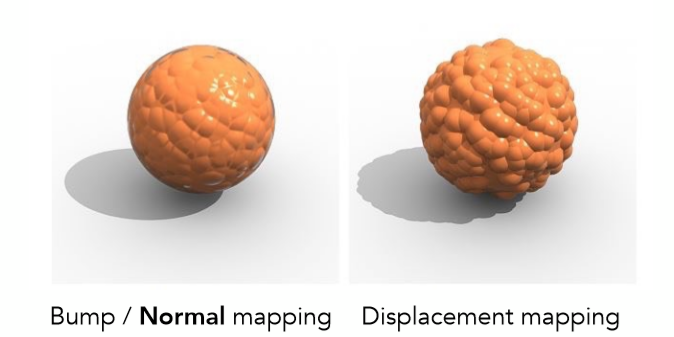
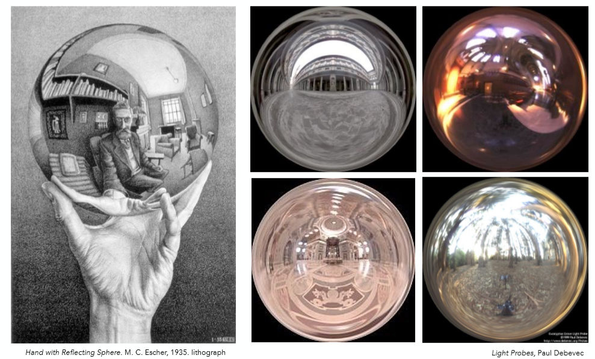
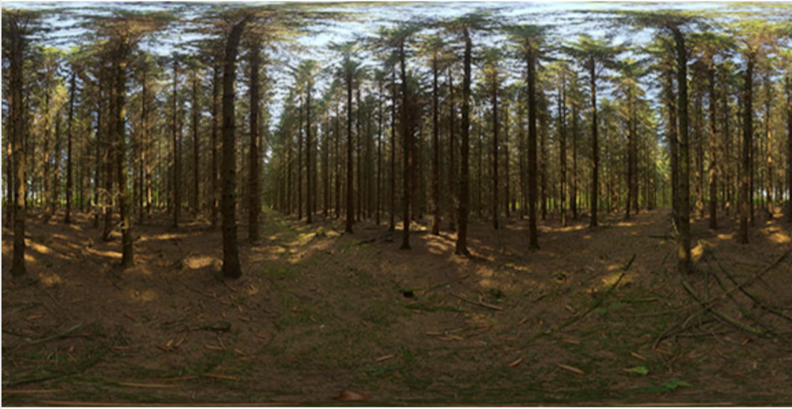
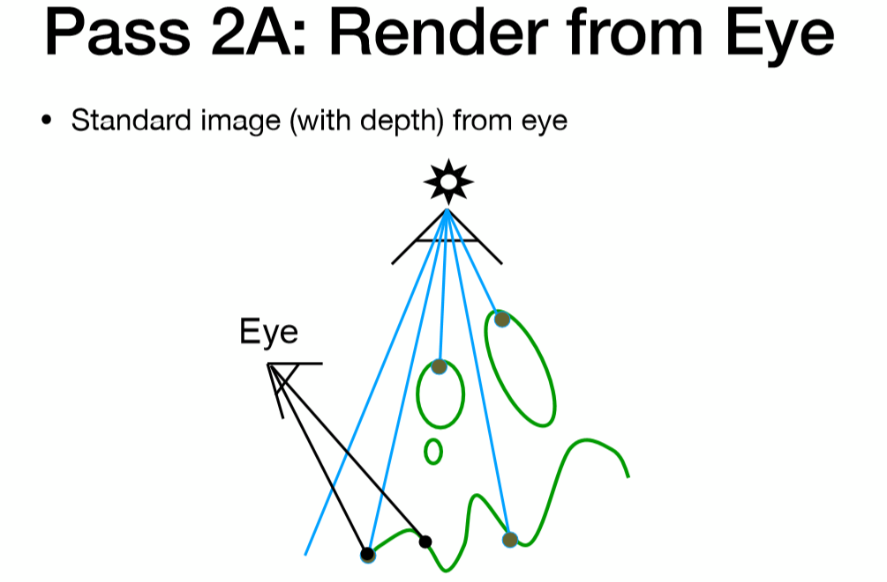
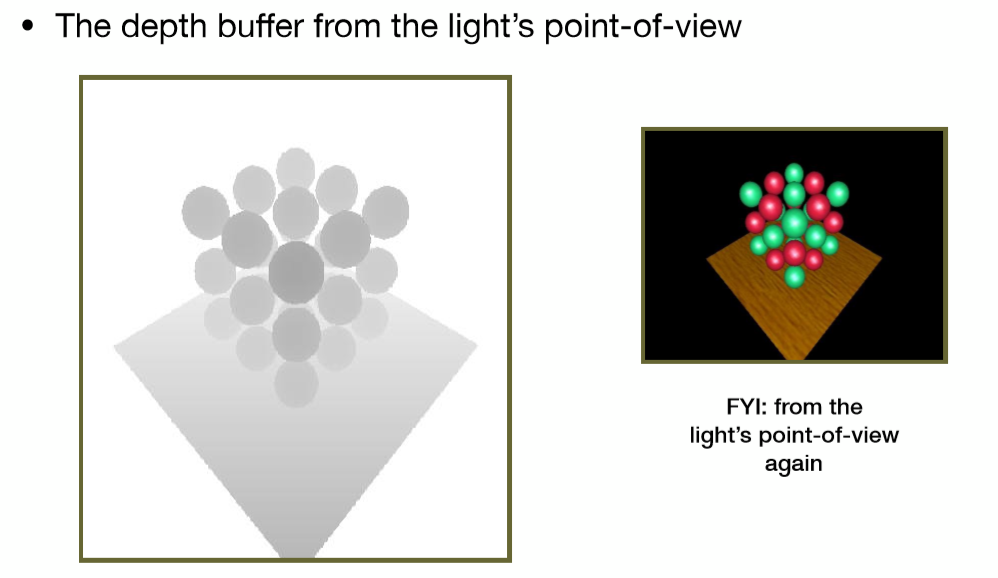

# 计算机图形学八：纹理映射的应用(法线贴图，凹凸贴图与阴影贴图等相关应用的原理详解)

在现代GPU里，我们可以把纹理理解成一块内存，以及包括我们可以对这块内存上的区域做范围查询或者过滤，即这样一块内存，我们可以对这块内存做点查询或者范围查询。即纹理我们可以理解为一块数据，我们能对该数据做查询处理，没必要将其完全限制在图像上。从这个角度出发，纹理可以表述的东西就非常多了，比如：环境光照，

## **纹理映射的应用**

在上一节内容中，我们详细介绍了纹理映射的概念，以及纹理贴图过大过小带来的种种问题与解决方案，但纹理映射的应用远不止单单作为diffuse的反射系数来表现出不同颜色。本文会详细介绍一些主要的纹理映射的应用及其原理，首先从法线映射和切线空间开始说起。

## **1 Normal Maps及切线空间**

在Blinn-Phong光照模型中，法线向量扮演着重要的一环，不同的法线向量对光照的计算结果有着很大的影响，打个比方，倘若将一个高精度模型法线信息套用在低精度模型之上，会使低精度模型的渲染效果有着巨大的提升。

那么如何做到呢？我们知道Texture上可以存储3维的颜色信息作为漫反射系数，那么自然也就可以存储法线向量的信息！同样利用(u,v)坐标去查询每个点的法线向量，而不使用原来模型法线信息，达到各种不同的效果，这就是Normal Maps。

明白了Normal Maps的原理之后，有一点重要的是，如何在存储这些法线信息呢？一种可选的方法是，存储object space下的法线向量坐标(这会使得法线贴图看起来五颜六色的)，好处是取出来转换到世界坐标就可以直接使用，坏处是一但该法线向量的三角形面发生了变形(如人物模型在做各种动画)，那么该法线向量就不再正确。这也就引出了第二种方法，存储切线空间之的法线向量坐标(这会使得法线贴图大部分呈蓝色，原因下文会提)。任何空间坐标系都要由3个互相正交的基底向量构成，切线空间也不例外，如下图所示：

其z轴由原来该面上的几何法线n构成，指向物体表面的外侧。x，y轴分别由该面所对应的贴图上U,V增加的两个方向构成，称之为tangant轴和bitangent轴。这样我们称tangant轴（t）、bitangent轴（b）及法线轴（N）所组成的坐标系，即切线空间（tbn）。

法线向量N可以根据原来的模型信息得到，如何去计算t，b呢？

如上图所示，记一个三角形的面的三个顶点分别为p0,p1,p2，并且使用(ui,vi)来表示对应顶点的texture坐标，那么根据顶点坐标的差值，纹理坐标的差值，以及t,b两轴，可以得到如下关系
$$
P_i - P_j = (u_i - u_j)t + (v_i - v_j)b
$$
为了进一步简化公式，设：
$$
e_1 = p_1 - p_0, (x_1, y_1) = (u_1 - u_0, v_1 - v_0)
\\
\\
e_2 = p_2 - p_0, (x_2, y_2) = (u_2 - u_0, v_2 - v_0)
$$
那么便可以把第一个公式简化为如下形式：
$$
e_1 = x_1 t + y_1 b
\\
\\
e_2 = x-2 t + y_2 b
$$
利用线代知识，将其写为矩阵形式:
$$
\begin{bmatrix}
↑ & ↑ \\
e_1 & e_2 \\
↓ & ↓ \\
\end{bmatrix}
=
\begin{bmatrix}
↑ & ↑ \\
t & b \\
↓ & ↓ \\
\end{bmatrix}
\begin{bmatrix}
x_1 & x_2 \\
y_1 & y_2 \\
\end{bmatrix}
$$
相信熟悉线性方程组的同学，已经知道如何解出t，b向量了，两边同乘系数矩阵的逆即可得到:
$$
\begin{bmatrix}
↑ & ↑ \\
t & b \\
↓ & ↓ \\
\end{bmatrix}
=
\frac{1}{x_1 y_2 - x_2 y_1}
\begin{bmatrix}
↑ & ↑ \\
e_1 & e_2 \\
↓ & ↓ \\
\end{bmatrix}
\begin{bmatrix}
y_2 & -x_2 \\
-y_1 & x_1 \\
\end{bmatrix}
$$
其中右边式子中的变量全部已知，自然就已经成功求出t,b两轴向量，再加上原几何法线向量n，至此便已经得出了切线空间(tbn)。法线贴图的数据就存储在空间之下，对于没有变动的法线向量就是(0,0,1)而这恰巧也就解释了为什么法线贴图大部分都是蓝色的(因为大部分法线一般不变动)。

具体实施的时候只需利用[t b n]向量组成的矩阵乘以法线贴图上的存储3维信息，即可得到正确的法线向量了，此时正确法线向量所存在的坐标系与用在构建该坐标系的法向n是同一个坐标系下(当然也就是记录p0,p1,p2的坐标系)。

**以下tips不想深究的可以跳过，不影响之后阅读**

**tips: 1.求出来的t,b两轴并不一定保证垂直，有时候还需再加一步施密特正交化如下：(提一句施密特正交化的几何意义就是减去除了与之垂直的所有分量值，剩下的就只有垂直分量了)**

$t_⊥ = normolized(t - (t.n)n)$（t减去t平行于n的分量，得到t与n垂直分量）

$b_⊥= normolized⁡(b−(b⋅n)n−(b⋅t_⊥)t_⊥)$ （b减去b平行于$t_⊥$的分量，再减去与n的平行分量，剩下的就是与n，$t_⊥$垂直的分量，想象将b分为3个沿着基向量方向的向量之和即可）

**tips: 2.真正存储的时候只需要t 和 n即可，第三轴可以直接叉乘得到。并且将t和n作为顶点的属性进行存储，正如顶点n是共享该点的面法线均值，t同样是所有共享该点的三角面分别计算出来t的均值，与法线可以作为定点属性插值一样，t也可以**

## **2 Bump Maps**

Bump Maps其实与Normal Maps十分类似，Normal Maps直接存储了法线信息，而Bump Maps存储的是该点逻辑上的相对高度(可为负值)，该高度的变化实际上表现了物体表面凹凸不平的特质，利用该高度信息，再计算出该点法线向量，最后再利用该法线计算光照，这就是Bump Maps的过程，只不过比直接的Normal Maps多了一步从height到normal向量。

通过凹凸贴图记录的点与基准的高度差，可以近似内部有很多小三角形，这些小三角形的法线各不相同，所以点的法线通过临近的法线和求平均得到，这样法线的方向就改变了，因为法线方向改变，在shading着色的时候，比如Phong着色模型来说，是逐像素进行着色的，这里面法线方向是一个很重要的量，因为在算高光和漫反射的时候都会用到，所以这样的话，就会产生凹凸效果。计算的时候，不是去拿顶点自身的法线去做计算，而是去拿采样到的法线去做计算。

那么所需要关心的问题就是，如何从相对高度计算出法线向量呢？

通过法线贴图（凹凸贴图），我们可以去定义一个复杂的纹理，但是我们并不去改变任何的几何信息，也就是对于一个空间几何体，它原本有多少三角形，依旧还是有多少三角形。对于凹凸贴图，我们做的事是对任何一个像素，都去做一个扰动。这个扰动如何实现？就是通过我们定义的这个凹凸贴图，它里面有不同位置的高度信息，通过这个高度信息，我们去计算这个像素点他邻近位置的高度差，然后重新去计算该像素点的法线。

该过程也很容易理解，这里就直接用闫老师课上的Slides作为解答了，2维情况如下：

假设任何一个点，它原本是一个平面，平面上P点的法线是 $n(p) = (0, 1)$,一个向上的法线。

然后我这边定义了一个凹凸贴图，如下的这个蓝色曲线，在任何一点处如何计算该凹凸贴图给出来在该点的梯度（即改点处凹凸贴图曲线函数的倒数），即在该点出，我向右移动一个单位距离，它向上会移动多少距离（dp）。即该凹凸贴图上任何一点的切线如何计算？即下图中第二点指代的，用相邻两个点的高度差除以间隔1，这里C是一个常数，用于定义该凹凸贴图的影响系数。即我们可以用一个很简单的差分方法来计算一个点的切线。

这里我们得到了切线，但是我们想要得到的是法线，如何从切线得到法线？从图中可以看到，法线是垂直切线的，那么我们可以用向量来表示切线，(1, dp)，然后f法线可以由切线逆时针旋转90°得到，（1，dp)逆时针旋转90度，很简单，把x,y对换，然后把y取负，得到法线（-dp,1)。然后进行归一化，转为单位向量。

所以思路就是，我们用凹凸贴图去定义切线，然后用切线算法线，

3维情况可以类推得到：

3维情况下，假设我们有这样一个平面，该平面上一点P的法线向上，$N(P) = (0,0,1)$。我们仍然可以求出该点的梯度，只不过在3维中，梯度有两个方向，一个U方向，一个V方向，
$$
dp/du = c1 * [h(u+1)-h(u)]\\
dp/dv = c2 * [h(v+1)-h(v)]
$$
得到两个方向的梯度后（倒数），然后类比2维中的情况，将倒数1和倒数2取反，加1，然后做归一化得到法线。
$$
n = (-dp/du, -dp/dv, 1).normalized()
$$
其实也可以这样想，求出U和V方向上该点的切线，然后就可以确定该点的切平面，然后将两切线做叉乘就可得到改点的法线。然后做归一化处理为单位向量。

正如最后一点所标注的，所有计算出来的法线都是局部坐标即切线空间之下，因此还需要左乘[t b n]矩阵转到(世界)相机坐标系之下得到正确法向！

## **3 Displacement Maps（位移贴图/置换贴图）**

Displacement Maps其实又与Bump Maps十分类似了，在第二章作者提到了，Bump Maps是逻辑上的高度改变，而Displacement Maps则是物理上的高度改变，二者的区别就在此处，位移贴图实际上是真正的改变了图形上三角形顶点的高度（坐标），修改了几何形态的，而不像凹凸贴图只是做一个法线的替换达到假的视觉效果，可以通过物体阴影的边缘发现这点，还可以通过物体自身需要反射自己阴影的地方也能看到两者的区别：

位移贴图有一个要求就是你模型的三角形需要定义得足够细，细到你三角形顶点的间隔比你贴图上定义的纹理频率还要高才行。因为它改变的是三角形顶点的位置，如果你三角形比较大，在位移贴图的纹理中，一些纹理被映射到三角形内部的位置，那么这时候这些纹理就改变不了模型顶点，所以它就需要你所定义的三角形能够跟得上你定义的位移贴图纹理变化频率。

那这时候有人就问了，那这样做和你直接建一个高模有什么区别？因为这样做能够动态做一些特效，比如放技能时，球面凸起，放完后球面恢复，同一个模型可以随意添加位移贴图，但是想要再建一个模型的话就太慢了，贴图修改方便，但是模型后期修改难度大。

当然也相继带来一个问题，问：我能不能一开始的时候用一个相对粗糙的模型，在我应用位移贴图的过程中，我来检测一下，我是否应该把这个三角形变得更小，变得更细，如果我需要，我在把这个三角形拆开，细分为更小的三角形，再继续做位移贴图，是的，我们是可以这样做的，这就是DirectX（只能用在Windows）这个图形学API所提供的方案，叫做动态曲面细分（Dynamic tessellation）。

## **4 Environment Maps**

环境光映射，顾名思义就是将环境光存储在一个贴图之上。想象这样一个情形，光照离我们的物体的距离十分遥远，因此对于物体上的各个点光照方向几乎没有区别，那么唯一的变量就是人眼所观察的方向了，因此各个方向的光源就可以用一个球体进行存储,即任意一个3D方向，都标志着一个texel：

进一步就像地球仪一样，利用墨卡托投影或是其它类似的方法将球上的信息转换成一个平面上，就得到了环境Texture了:

以下给出分别在光线追踪以及Blinn-Phong模型利用环境映射的伪代码:(不熟悉光线追踪可以掠过该部分伪代码)

可以看到在光线未能撞击物体的时候，会利用光线方向求得展开之后贴图上的(u,v)坐标，再去查询颜色返回。

对于Blinn-Phong模型来说只需增加一项反射的颜色即可，如下:

利用观察方向相对于法线的反射方向去查询环境映射的颜色值。

但是用一个球体来存储环境光有一个比较明显的缺点，仔细观察上文当中展开的那副Texture图可以观察看到，上方和下方均有较为严重的扭曲，因此另外一种存储的方法就是Cube Map，也就是天空盒:

一个天空盒有6幅Texture来表示，明显相对球体少了很多扭曲的情况，但是中间多了一步从方向到面上的计算:

简单来说就是利用方向计算出与对应平面上的交点坐标，剔除平面所对应的一维，剩下来的两维坐标转换到(0,1)范围之内即为(u,v)坐标。

举个例子: 一个方向为(1,2,3)则其与z = 1平面的交点为(1/3,2/3,1) （找最近的平面交点，其实也就是方向向量最大的那一维所代表的平面），剔除z轴之后剩下为(1/3,2/3), 在进行(1+x)/2的转换(因为方向存在负值，而uv坐标不存在)，则得到z = 1的那一幅Texture上的 uv坐标为(2/3,5/6)。

## **5 阴影贴图Shadow Maps**

## **5.1 阴影贴图的原理及其缺陷**

从光栅化的过程一路走来会发现阴影这个问题一直没有涉及，今天就可以真正的利用阴影贴图来一定程度上的解决这个问题了！

首先，思考一个问题，为什么会有阴影？

**因为光源照射不到，更具体点，摄像机能看到的地方，光源“看”不见。**

而这正是启发阴影贴图这种做法的动机，接下来我们便来看看详细过程是怎么样的。

**第一步，把光源当做一个摄像机让它去看，去渲染整个场景一遍从而得到从光源视角的深度Buffer，记为dmap** (注：此时得到的这个 dmap 即为shadow maps)

**第二步，从设定好的摄像机位置去真正的渲染场景。**

**第三步，将所有摄像机视角可见点，利用光源视角下的那一套投影矩阵，重新投影回光源，得到光源视角下的屏幕坐标，找到该屏幕坐标在dmap上的深度值**

**如果该点在dmap上的深度值与投影回光源的点的实际深度值相等，则说明此点可被光源照射，因此不在阴影中，如下图黄色线这种情况**

**如果该点在dmap上的深度值小于投影回光源的点的实际深度值，则说明此点不可被光源看见，即该点前方有物体遮挡，因此在阴影中，如下图红色线这种情况**

如此便能确定每个可见像素点是否在阴影之中了，如果在阴影之中就不去计算Blinn-Phong中的镜面反射项与漫反射项。效果如下图：

对应可视化的shadow maps如下，距离光源越近代表深度越小，所以颜色越黑，反之亦然：

对于shadow maps还有几点小细节可以谈(可略过)

**1 浮点数难以判断相等，所以一般会有一个tolerance**

**2 shadow maps查询时不采用双线性插值，只寻找最近的点，因为倘若插值发生在物体边缘时，与邻接点的深度差距很大，会导致插值结果会有很大的误差**

**3 属于硬阴影，只适用于点光源**

软硬阴影示意如下，上方棱角分明为硬阴影，下方为软阴影：

产生这种问题的原因是因为光源具有体积，导致，有的地方完全看不到光源(本影, Umbra), 有的地方能看到一部分光源(半影，Penumbra)。所以阴影的边缘会有过渡的情况，从而产生软阴影现象，就像上图中太阳与地球的示意一样(全日食与半日食)