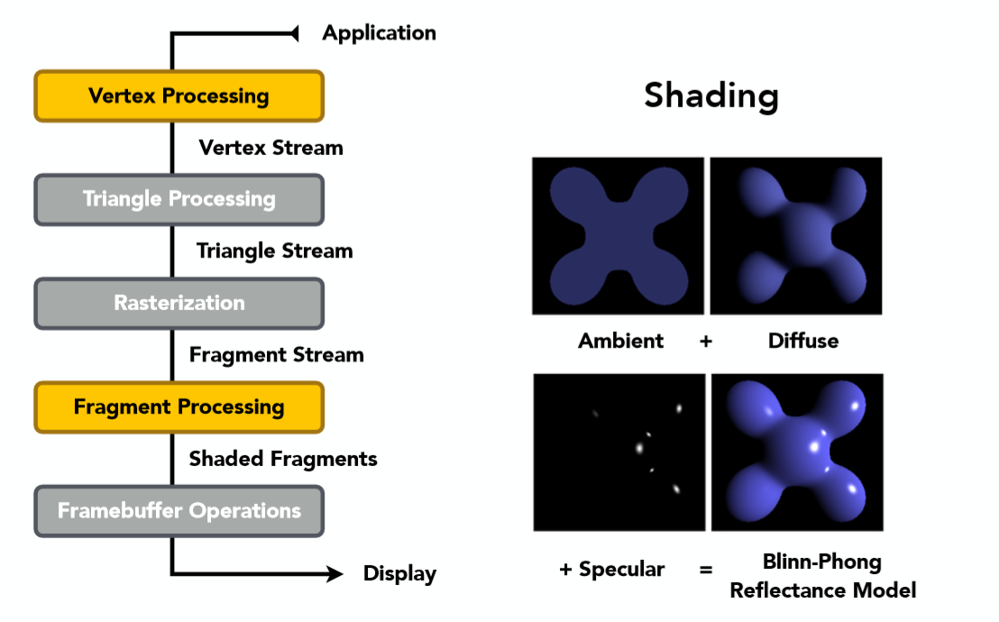

# 计算机图形学六：正确使用重心坐标插值(透视矫正插值(Perspective-Correct Interpolation))和图形渲染管线总结

## **透视矫正插值和图形渲染管线总结**

正如上一文章中所提到的，我们的重心坐标往往都是在屏幕空间下所得到的，如果直接使用屏幕空间下的重心坐标进行插值会造成一定的误差，与在view space下是不一样的，那么本节内容就会具体介绍如何矫正这种误差，利用屏幕空间下的重心坐标达到正确的插值。在此之后也会对到目前为止的所有内容进行总结，即图形渲染管线。

## **1 透视矫正插值(Perspective-Correct Interpolation)**

(为了证明的简便性，我们利用深度值Z的线性插值进行说明，重心坐标插值可以类比得到) 该问题可以很简单在上图之中表现出来，简单叙述一下，在屏幕空间进行线性插值得到点c的intensity为0.5，然而对于在view space之中正确的插值结果，可以很明显看到C的intensity绝不为0.5。这也就造成了插值的误差，应该去矫正！

首先先分别定义屏幕空间的比例为s，view space中为t，其余符号含义如下图所示：

为了简便证明，将点的坐标用2维表示，第一维为图中所示的x轴，第二维为z轴。 简而言之，我们的目标就是得出t与s的关系式，这样就可以正确的利用屏幕空间的系数s插值到正确的view space的结果，推导过程如下。

由上图所示的投影所造成的三角形相似性可以轻易得出如下几个式子：
$$
\frac{X_1}{Z_1} = \frac{u_1}{d} ⇒ X_1 = \frac{u_1Z_1}{d}
\\
\\
\frac{X_2}{Z_2} = \frac{u_2}{d} ⇒ X_2 = \frac{u_2Z_2}{d}
\\
\\
\frac{X_t}{Z_t} = \frac{u_s}{d} ⇒ Z_t = \frac{dX_t}{u_s}
\\
\\
$$

同样，分别利用screen space 以及 view space的线性插值可以得到以下几个式子：

$$
U_S = U_1 + s(u_2-u_1)
\\
\\
X_t = X_1 + t(X_2 - X_1)
\\
\\
z_t = Z_1 + t(Z_2 - Z_1)
\\
\\
$$
将4式与5式代入3式得：

$$
Z_t = \frac{d(\frac{u_1Z_1}{d} + t(\frac{u_2Z_2}{d} - \frac{u_1Z_1}{d}))}{u_1 + s(u_2-u_1)}
\\
= \frac{u_1Z_1 + t(u_2Z_2 - u_1Z_1)}{u_1 + s(u_2 - u_1)}
\\
\\
$$
再将1式与2式代入7式得：

$$
Z_t = \frac{d(\frac{u_1Z_1}{d} + t(\frac{u_2Z_2}{d} - \frac{u_1Z_1}{d}))}{u_1 + s(u_2-u_1)}
\\
= \frac{u_1Z_1 + t(u_2Z_2 - u_1Z_1)}{u_1 + s(u_2 - u_1)}
\\
\\
$$
最后将6式代入8式的左边得到：

$$
Z_1 + t(Z_2 - Z_1) = \frac{u_1Z_1 + t(u_2Z_2 - u_1Z_1)}{u_1 + s(u_2 - u_1)}
$$
仔细观察9式，我们已经成功得出了t与s的一个关系式，其中的其它参数都是已知，因此进一步化简不在这里展开，可以得到如下t与s关系：

$$
t = \frac{sZ_1}{sZ_1 + (1-s)Z_2}
$$
如此就可以利用屏幕空间下的系数得到正确插值结果了，计算如下：

$$
Z_t = Z_1 + \frac{sZ_1}{sZ_1 + (1-s)Z_2}(Z_2 - Z_1)
\\
= \frac{1}{\frac{s}{Z_2}+\frac{(1-s)}{Z_1}}
$$
以上证明虽然只是针对线性插值的矫正结果，对于重心坐标插值，我们可以类似类推得出：

$$
Z_t = \frac{1}{\frac{α}{Z_A} + \frac{β}{Z_B} + \frac{γ}{Z_C}}
$$
正确得出深度的插值结果之后，再看看任意属性(法线向量，纹理坐标，view space 坐标)插值结果，依然以线性插值为例先进行推导：用I代表任意属性

$$
I_t = I_1 + t(I_2 - I_1)
\\
\\
I_t = I_1 + \frac{sZ_1}{sZ_1 + (1-s)Z_2}(I_2 - I_1)
\\
\\
I_t = (\frac{I_1}{Z_1} + s(\frac{I_2}{Z_2} - \frac{I_1}{Z_1}))/\frac{1}{Z_t}
$$
（建议读者自行推导一遍上述所有过程，加深记忆） 不难看出插值的分母就是深度值的倒数，类推得出重心坐标任意属性的正确插值如下:

$$
I_t = (α\frac{I_A}{Z_A} + β\frac{I_B}{Z_B} + γ\frac{I_C}{Z_C})/\frac{1}{Z_t}
$$
（tips:任意属性自然包括深度值，将深度值z代入16式可以得出与12式一样的结果） 至此，我们就可以利用16式进行所有的属性的重心坐标插值，并且保证结果正确了！

## **2 图形渲染管线总结**

所谓图形渲染管线指的是一系列操作的流程，这个流程具体来说就是将一堆具有三维几何信息的数据点最终转换到二维屏幕空间的像素。其实也就是本系列笔记之前的所有知识连贯起来。我们以如下图作为一个总结，再具体分步骤讲解：

（整个图形管线的步骤可能有不同的分法，不一定就是上图所述的5部分，但整体流程一定是一样的） 首先来看第一个，顶点处理：

顶点处理的作用是指对所有的顶点数据进行Model，View，和Projection的变换，最终得到投影到二维平面的坐标信息(同时为了Zbuffer保留深度z值)。当然如果超出观察空间的会被剪裁掉(关于剪裁的知识因为闫老师的课并没有多提，所以本系列笔记也暂未设及到，但是会在之后进行该部分知识的补充)。 而第二步三角形处理也十分容易理解，就是将所有的顶点按照原几何信息，变成三角面，每个面由3个顶点组成。得到了许许多多个三角形之后，接下来的操作自然就是三角形光栅化了，这也是前几节笔记之中的重点内容之一：

在进行完三角形的光栅化之后，知道了哪些在三角形内的点可以被显示，那么如何确定每个像素点或者说片元(Fragement)的颜色呢？[注：片元可能比像素更小，如MSAA抗拒齿操作的进一步细分得到的采样点]。那自然就是着色了，也就是片元处理阶段应该做的。

注意这阶段顶点处理也亮起来是因为我们需要顶点信息对三角形内的点进行属性插值(tips：当然也可以直接在顶点处理阶段就算出每个顶点的颜色值，如Gouraud Shading一样)。当然这一阶段也少不了Z-Buffer来帮助确定，哪些像素点应该显示在屏幕上，哪些点被遮挡了不应该显示(这一步也有不少书籍归结在最后一步中，个人感觉差求不多，重要在于理解整个过程吧)：

最后一步！Framebuffer的处理，就是将所有的像素颜色信息整合在一起，输送给显示设备加以显示。这也就完成了整个图形渲染管线了。

(tips:其实在片元处理阶段有一点还未叙述，我们也可以去做texture mapping，利用texture的信息来代替blinn-phong模型漫反射系数来当作颜色，这一部分的内容会在下一节笔记中叙述！)

在这里简单的提一下shader program，shader program分两种，分别是对顶点以及对片元的处理，程序员可以自行编程来代替原来固定的顶点处理和片元处理从而达到各种各样令人惊叹的效果！这也就是现在的可编程渲染管线。

## **总结**

其实对于透视校正插值这一块确实是一个小坑，不少人应该在刚学习的时候都不会注意到，包括我也是，最后也是看知乎上一些大佬的回答才找了一些资料弄明白了这一块。对于图形渲染管线来说，其实就是对光栅化的一个总结，把整个流程拎出来能够有一个更加清晰的认识。