# 计算机图形学十一：几何3—曲面细分(Mesh subdivision)与曲面简化(Mesh Smplication)

## **曲面细分与曲面简化**

## **摘要**

曲面细分与曲面简化分别是什么，以及为什么需要这些技术呢？ 其实这二种技术所做的事情从名字就能看出一二:

**曲面细分是指将一个模型的面合理的分成更多小的面，从而提升模型精度，提高渲染效果** **曲面简化是指将一个模型的面合理的合成更少的面，从而降低模型精度，为特定情形下提供使用(如LOD技术)**

明白二者定义及目的之后，来看两张示意图提供intuitive的理解

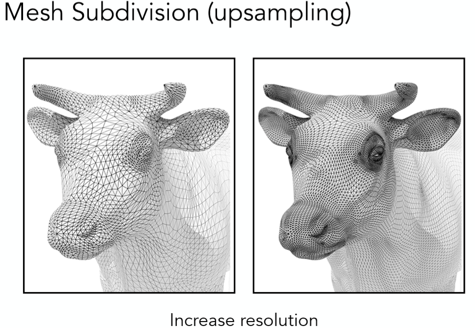

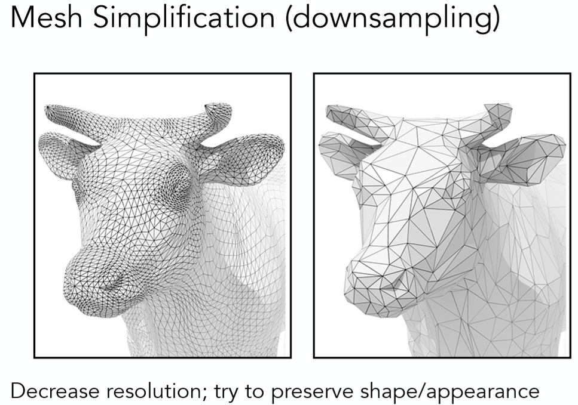

当然除了细分与简化之外，还有另外一种同属一类的操作叫做曲面规则化（Mesh Regularization）其所作的便是将三角面都变的尽可能相同，从而也达到提升模型效果的目的，对于该类技术本文不做详解

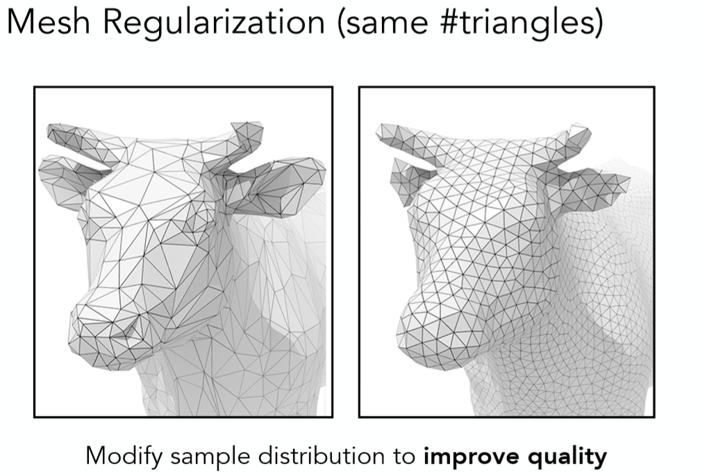

接下来，我们就来看看这细分与简化究竟是怎么做到的。

## **1 曲面细分(Mesh Subdivision)**

## **1.1 Loop细分(Loop Subdivision)**

(这里的loop是人名，可不是循环的意思噢) Loop细分是一种专门针对三角形面的细分方法，其核心步骤也十分容易理解

**1 生成更多三角形或顶点**

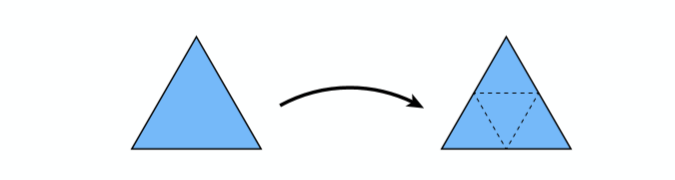

如图所示在，连接每条边的中点生成一个新的三角形，原来的三角形就会被分割成4个三角形。

**2 调整这些三角形或顶点的位置**

我们将所有的顶点分为两类，一类是新生成的顶点，一类是老的原来就有的顶点，对于新生成的顶点做如下处理：

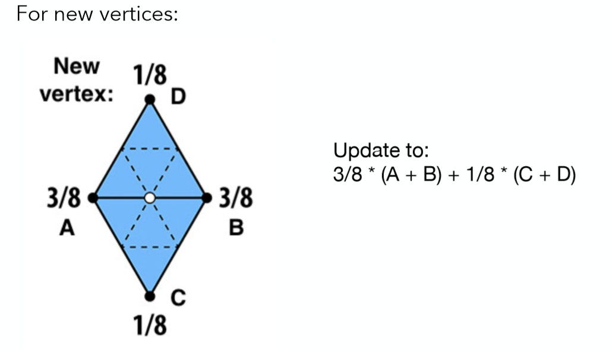

这里新的顶点就是白色的那个顶点，其位置为周围4个顶点的权重之和，各顶点权重如图所示，其余边上的新顶点处理类似。

对于旧的顶点，做如下处理：

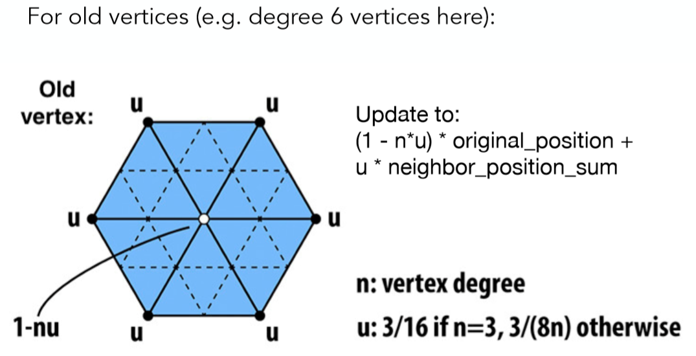

其实旧每个顶点的处理也十分类似，这里以图中一个白色旧顶点为例，也是其自身以及邻接顶点的权重和，但权重的设置与该旧顶点度数有关，具体如图中右下部分所示。

以上就是Loop细分的全过程了，最后看看效果： (这是一个不断进行Loop细分的例子)

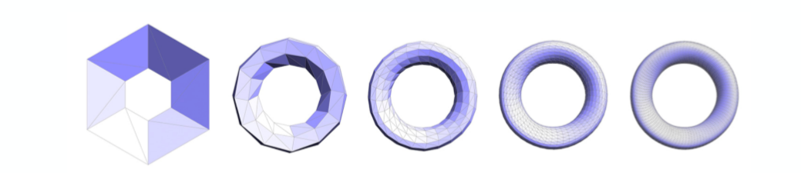

## **1.2 Catmull-Clark细分(Catmull-Clark Subdivision)**

**（今年图灵奖得主整的算法噢！）**

正如上文所说Loop细分针对是所有三角形面，那么对于不仅仅只有三角形面该怎么办呢？这也就有了Catmull-Clark细分，这里以四边形面和三角面的混合为例： 首先做一些定义：

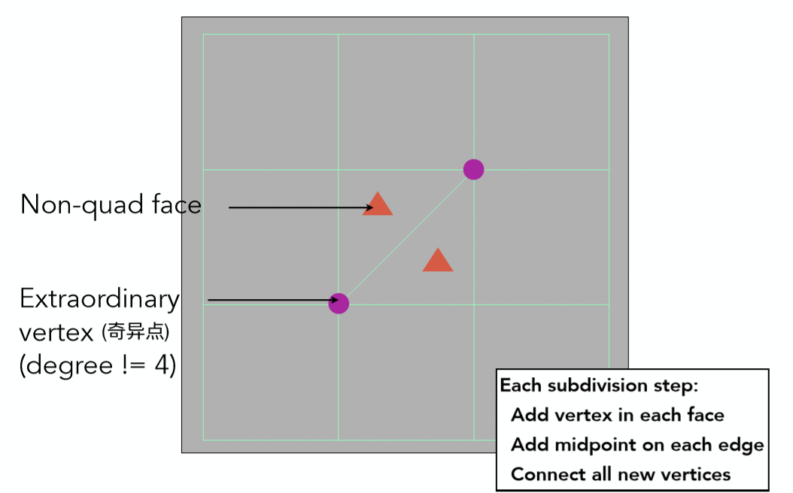

**1 对于所有不是四边形的面，称之为Non-quad face**

**2 所有度不为4的顶点称之为奇异点**

**3 每次细分步骤如图中右下角所示，在每个面中都添加一个点，在每条边的中点也都添加一个点，面上的新顶点连接所有边上的新顶点，结果如下图所示：**

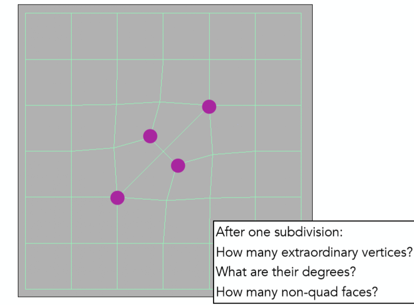

考虑右下角几个问题，其实也是一些Catmull-Clark细分的特点

**1 有几个非四边形面，就会多出几个奇异点，所以现在一共有2+2 = 4个**

**2 新多出来的奇异点的度数与原来所在面的边数相等，如这里就是3度**

**3 第一次细分之后所有面都会变成四边形，且往后奇异点数目不再增加**

这里给出一个再一次细分的结果：

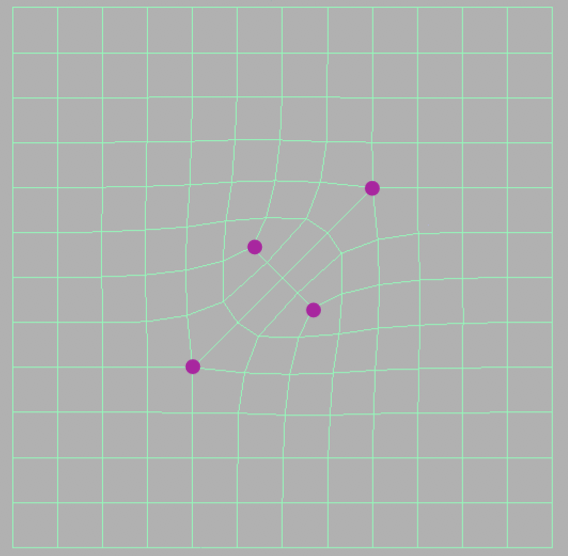

可以看到奇异点依然是4个，不再改变。

以上我们明白了如何增加新顶点，与Loop细分类似，同样需要去调整各类顶点的位置，这里将所有的顶点分为三类，对于各类顶点位置调整如下图所示：

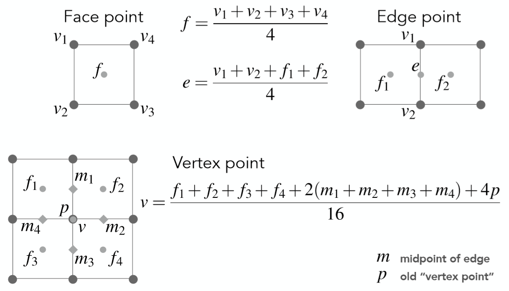

图中对于3类顶点每次细分之后新的位置讲述的已经很清楚了，读者也不必太过纠结，明白过程大概即可。

Loop细分 V.S Catmull-Clark细分：

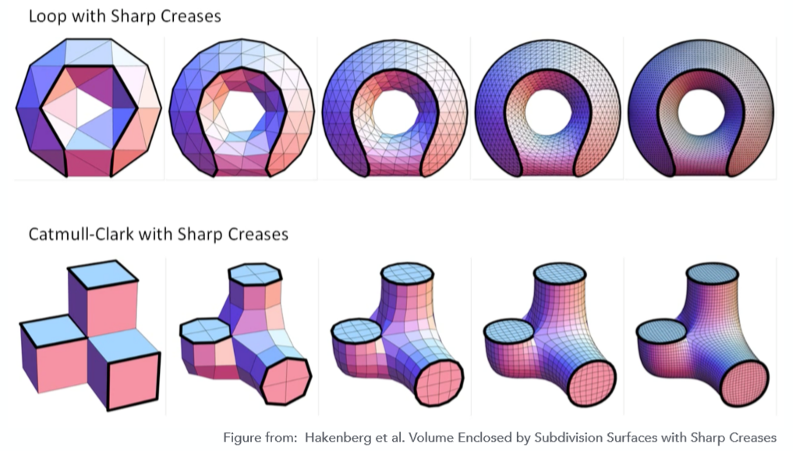

## **2 曲面简化(Mesh Smplication)**

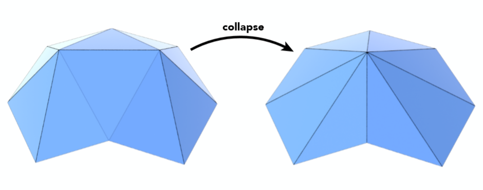

其实曲面简化所利用的一个方法叫做边坍缩，如上图所示就是将一条边的两个顶点合成为一个顶点。但随之而来的问题就是，曲面简化需要尽量保持原本模型的shape，如何坍缩一条边，或者说坍缩哪一条边能够使得原模型样貌被改变的程度最小，这就是曲面简化的关键所在。

为此引入一个度量，即二次误差度量(Quadric Error Metrics)

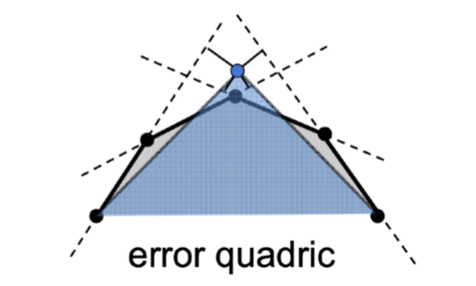

即坍缩之后蓝色新顶点所在的位置与原来各个平面的垂直距离之和。如果能够使得这个误差最小那么对整个模型样貌修改一定程度上也会较小。

那么其实到这整个曲面简化的算法流程已经比较清晰了

**1 为模型每条边赋值，其值为坍缩这条边之后，代替两个老顶点的新顶点所能得到的最小二次误差度量**

**2 选取权值最小的边做坍缩，新顶点位置为原来计算得出使得二次误差最小的位置**

**3 坍缩完之后，与之相连其他的边的位置会改动，更新这些边的权值**

**4 重复上述步骤，直到到达终止条件**

这其实是一个标准的贪心算法，可能到不了全局最优解，但事实证明最终的结果依然相当不错

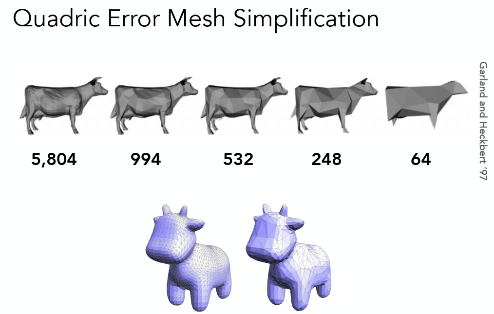

## **总结**

至此整个几何部分就已经完结了，本系列涉及的几何内容相对而言还是较少，不过还是能够有一个大概的把握，从隐式曲面，显示曲面的各种类型，到显示曲面当中贝塞尔曲线曲面的详细讲解，再到今天的曲面细分与曲面简化。整体内容与闫令琪老师课上的内容一致(也是很期待暑假的进阶课程)。接下来的本系列笔记就会正式开始基础的光线追踪与PBR了。
