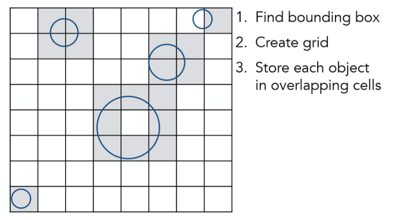
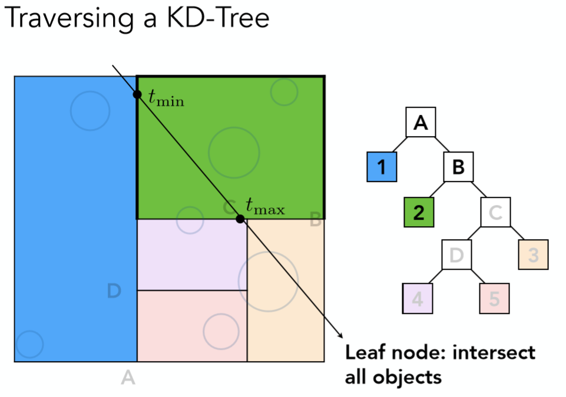

# 计算机图形学十三：利用包围盒技术加速光线追踪（KD-Tree and BVH）

## **加速光线追踪**

## **摘要**

在上一节中，我们介绍了whited-style光线追踪的原理，以及实现细节。相比与光栅化中所使用的的Blinn-Phong模型，光线追踪显著了提升了图像质量，但随之而来的问题是渲染速度过慢。**因为在判断光线与场景交点的时候，需要去进行所有三角形面与光线的求交，而且这仅仅是对一个像素而言**。 那么总体来说光是进行光线与三角形的求交这样一个计算过程就一共要： **像素数量x三角形面数量x弹射次数**这么多次，如下图这样一个场景，一共就有10.7M的三角形面，你可以想象一共要多少次求交运算吗？

因此必须要寻求一些办法加速光线追踪的过程！

## **1 轴对齐包围盒(Axis-Aligned Bounding Box)**

AABB(即轴对齐包围盒)提出的motivation是十分自然的，当有的光线显然不会与一个物体相交的时候，那么自然也没有必要去遍历该物体的所有三角形面，因此利用一个包围盒包住该物体，在与该物体的三角面计算求交之前先判断光线是否与包围盒相交，倘若连包围盒都与光线没有交点的话，那么显然不会与物体的三角面有交点。

而所谓AABB也是一种包围盒，也是由三对平面的交集构成，只不过AABB的任意一对平面都与x-axis，y-axis或者z-axis垂直，所以称之为轴对齐包围盒。如下图所示：

之所以这么设置的原因是为了方便进行光线与包围盒的求交运算！既然谈到了光线与包围盒的求交，那我们就来看看该过程如何实现。

我们以2D AABB为例子，因此只有x，y两对平面（二维应该其实是线，不过为了统一性这里依然称为平面，不影响理解），3D情况可类推：

首先如上图最左边所示，求出光线与一对x平面的交点，将先进入的交点(偏小的那个)记为 tmin, 后出去的交点(偏大的那个)记为 tmax，紧接着如中间图所示计算出光线与y平面的两个交点同样记为另外一组tmin, tmax，当然计算的过程中要注意如果任意的 t < 0，那么这代表的是光线反向传播与对应平面的交点。

好了，看看现在我们得到了什么，光线与一对x平面的交点，与一对y平面的交点，究竟哪些点才是**真正与盒子的交点呢？**

**1 只有当光线进入了所有的平面才算是真正进入了盒子中**

**2 只要当光线离开了任意平面就算是真正离开了盒子**

所以对每对平面的tmin，tmax做如下运算(如果任意t值是负的也没有关系)
$$
t_{enter} =max\{t_{min}\},t_{exit} =min\{t_{max}\}
$$

其中$t_{enter} $与 $t_{exit} $分别对应了上述两点条件，而对应所举的2D例子，最终求出了两个真正的与包围盒的交点如最右边图所示。

但光线一定会与包围盒有交点吗？显然不是，因为我们的光线它不是一条直线，它是一条射线，那么什么条件下才会有交点呢？ 我们说当$t_{enter} < t_{exit} $ 的时候，光线**所在直线**一定在盒子中待过一段时间，也必然存在交点，但光线并不是直线，而是射线，除了保证了光线所在的直线在盒子里待过一段时间，还要考虑实际物理意义，具体如下：

相信这页slides已经讲的很清楚的，可以结合实例自己画画看便能加深理解。

什么时候，关系离开的时间是个负数呢？出现这种情况，就说明盒子一定在光线的背后，那么此时就可以不用考虑。

什么时候光线离开的时间大于等于0，并且进入时间小于0呢？出现这种情况，就说明光源点在盒子内部。

总结来说就是：当且仅当光线离开盒子时间大于光线进入时间并且离开盒子时间大于等于0时，我们认为光线和盒子相交

tips：在上一节就已经提到过光线与平面的求交，这里自然可以直接套用，但可以看看AABB为我们求交所带来的计算效率的提升：

## **2 均匀空间划分Uniform Spatial Partitions (Grids)**

在介绍完AABB之后，相信大家已经了解了其原理及实现方法，那接下来我们就要介绍一些利用AABB的加速方法。当然有些读者可能会有些疑惑，明明已经可以通过事先对每个物体求一个包围盒，在与三角形面求交之前先对包围盒求交，这样不是已经可以达到不错加速效果了吗？作者认为可以考虑这样两个极端情况：

**1 整个场景只有一个极其复杂的单一人物模型，那么只对这一个物体做包围盒的话，相当于对效率没有任何提升**

**2 整个场景充斥着大量的细小模型，如草，花之类的，每个模型可能只有很少的面，如果此时对每个物体求包围盒，得到的包围盒数量会相当之多，对于光线追踪效率来说效率提升有限**

基于以上两点考虑，AABB并不应只局限于以物体模型为单位，可以更加精细的考虑到以三角面为单位。另外对于场景的许许多多包围盒来说应该要有一种数据结构将其统领起来。 **因此如何更好的划分场景形成不同的AABB，使得划分之后的AABB能够更好的加速光线追踪，这就是接下来要考虑的问题关键！** (以下的划分形成的AABB更是一种general的概念，可能不会严格包围物体，读者不必纠结)

那么接下来就从最简单的划分方法，均匀空间划分开始介绍。 第一步对所要考虑的场景找一个包围盒：

第二步均匀划分这个大包围盒：

第三步在每个重叠小包围盒上存储物体模型信息

紧接着，根据光线的方向与判断出所有相交的方格(这一步可以利用bresenham算法)，倘若方格中存储有物体，再进一步与方格中的物体模型或是三角形面求交。

以上就是均匀空间划分的全部过程了，简单来说就是将空间划分为多个均匀的小的AABB，再根据光线方向找出相交grid(这一步并不需要判断所有方格，正如上文提示，可以用brenham类似的方法来做)，再判断grid中是否存储了模型信息，若有则进一步求交。（这种划分方法假设了找出相交方格要比直接判断与物体求交相对容易，因此划分方格数的多少也是性能的关键，方格太少，没有加速效果，方格太多，判断与方格的求交可能会拖累效率）

因此这种方法最适合的场景就是空间中均匀布满了三角形面，如下图这种场景：

如果说场景较为空旷，物体较小且分离得比较开，那么均匀分割的效果就会很差了，因为会有很多无效的方格与光线的求交过程。

## **3 KD-Tree空间划分**

在具体介绍KD-Tree空间划分的方法之前，首先来看看一些常用的空间划分方法：

第一种Oct-Tree，也就是八叉树，每次将空间分为8个相等的部分，再递归的对子空间进行划分，因为图中是2维例子，所以只划分了4部分。当划分的子空间足够小或是空间中三角形面的数量很少的时候会停止划分。这种方法的显著缺点是，随着维度的上升划分的空间数量会呈指数级增长。

第二种KD-Tree，也是本小节将要主要介绍的方法，其每次将空间划分为两部分，且划分依次沿着x-axis，y-axis，z-axis，即如图中所示，第一次横着将2维空间分为上下，第二次再竖着将上下两个子空间分别划分为左右部分，依次递归划分，终止条件与八叉树类似，细节问题之后按具体例子详解。

第三种BSP-Tree，其与KD-Tree类似，唯一不同的是划分不再沿着固定一轴，可以任意方向划分，缺点自然是划分的空间没有规则性，求交困难。

接下来从一个例子具体介绍KD-Tree 第一步将空间分为两部分

第二步对左右两个子空间换个方向再分为两部分(这里只画出了有半部分，其实左边也是一样)

如此递归的划分下去，且在划分过程当中遵循这样几点：

**1 依次沿着x-axis,y-axis,z-axis划分，使得空间被划分的更加平衡**

**2 划分的位置由空间中三角面的分布决定，具体细节不展开**

**3 叶子节点存储对应空间的所有物体或三角面信息，中间节点仅存储指针指向两个子空间**

**4 当划分空间太小或是子空间内只有少量三角形则停止划分**

当KD-Tree建立完成之后，如何进行光线与物体求交判断呢？过程如下： 第一步判断光线是否与最外层的包围盒相交

如果相交进一步判断是否与对应的两个子空间相交

注意！因图中做了简化，最大包围盒的左半边并没继续进行划分(实际上应该要划分的)，所以左半部分对应的1号空间是叶子节点，如果光线与之相交，进一步判断与存储与叶子节点的物体信息求交。左半边判断完之后，接着判断右半部分

同样如果对于有半部分存在相交情况，则对于右半部分的所有子空间，递归的执行这个步骤即可

更加具体的过程不再展开。

**优点：** 利用KD-Tree的结构来构建AABB的好处是倘若光线与哪一部分空间不相交，那么则可以省略该部分空间所有子空间的判断过程，在原始的纯粹的AABB之上更进一步提升了加速效率。

**缺点：** 缺点是判断包围盒与三角面的是否相交较难，因此划分的过程不是那么想象的简单，其次同一个三角面可能被不同的包围盒同时占有，这两个不同包围盒内的叶节点会同时存储这一个三角形面

综上所述，我们详细介绍了利用AABB的均匀划分方法，KD-Tree划分方法，也简略提及了Oct-Tree以及BSP-Tree。但其实这些技术在业界之中以及逐渐不再被多使用，但依然有很多借鉴参考价值，在下面一节会介绍一种现在被广泛使用的加速光线追踪的方法，即Bounding Volume Hierarchy。

## **4 Bounding Volume Hierarchy**

BVH与前几种方法最显著的区别就是，**不再以空间作为划分依据，而是从对象的角度考虑，即三角形面**，过程如下： 第一步同样找出场景的整体包围盒作为根节点

第二步找到合适的划分点，将最大包围盒内的三角形面分为两部分，再分别重新就算新的包围盒

注意到这里，**包围盒会重叠，但一个三角形面只会被存储在唯一的包围盒内，而这也就解决了KD-Tree的缺点！** 接下来与KD-Tree的建立类似，递归的对所有子空间重复该步骤

最终可以建立出如上图的所示的树形结构，同样为了画图方便，只进行了左半部分的划分，右半部分其实同理。

tips：

1. 每次划分一般选择最长的那一轴划分，假设是x轴，那么划分点选择所有三角面的重心坐标在x坐标上的中位数进行划分，如此便能保证划分的三角形左右两边三角形数量尽可能差不多，**当然也就使得树形结构建立的更加平衡，深度更小，平均搜索次数更少，提高了效率**，这些都是数据结构的知识，相信大家掌握的都不错，就不多赘述了。
2. 与KD-Tree一样，中间节点不存储物体三角面信息，只在叶节点中存储，终止条件可设定为当前包围盒内三角形数量足够少 （e.g. 5个）

最后给出这样一个BVH加速结构遍历节点的伪代码参考：

## **总结**

以上就是本节的所有内容，首先详细介绍了加速光线追踪的基础即AABB，接着说明了为什么需要在AABB的基础之上设计别的加速方法，在这里具体介绍了Uniform spatial partition，KD-Tree，以及被广泛使用的BVH结构。那么到这里对whited-style的光线追踪的全部内容其实已经讲解完毕了，接下来的几部分内容我们会去介绍**真正精确**基于物理的渲染模型，该部分内容确实较难