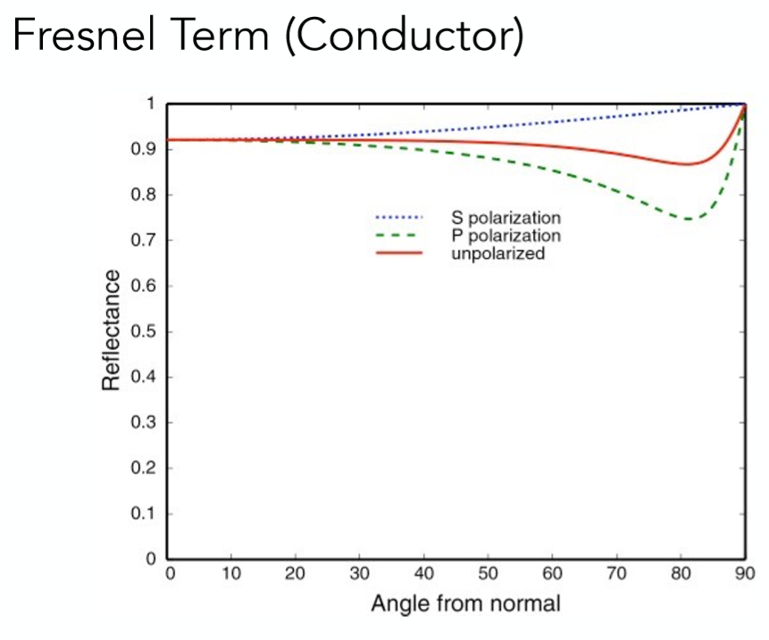
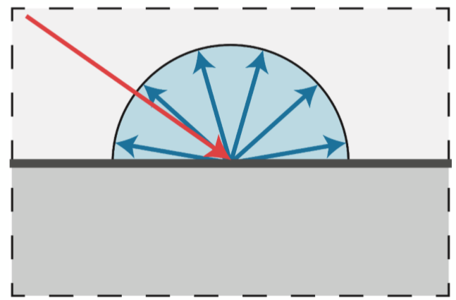

# 计算机图形学十二：Whitted-Style光线追踪原理详解及实现细节

## **Whitted-style光线追踪原理及其实现细节**

## **摘要**

本篇内容主要分为两部分，第一部分会从为什么需要光线追踪入手，一步步介绍Whitted-style光线追踪的原理。第二部分则会具体介绍一些光线追踪的实现细节，包括光线的表示，光线与物体的求交，以及反射折射方向的计算。

## **1 Whitted-Style 光线追踪**

在进入原理讲解之前，我们首先考虑一下为什么需要光线追踪呢？ **因为Blinn-Phong这种局部模型无法处理全局效果！** 举个例子：

如上图中房屋顶部的所接受到的光可不仅仅是Blinn-Phong模型考虑的直接光源，还有可能是来自窗外的光源照射到地板，再发生反射照射到了房屋顶部，而这部分光是局部光照模型没有考虑到的，而光线追踪正是为了解决这种问题所提出的一种考虑全局效果的光照模型。

## **1.1 光线追踪原理解释**

光线追踪听名字就知道，讨论的核心是光线，因此我们首先对光线做一些假设。

**1 光线一定沿着直线传播**

**2 光线之间无法碰撞**

**3 光线路径可逆，即从A发出的到B的光线，一定也可以从B发出到A（中途可发生反射和折射）**

明白了光线的一些假设之后，想一想人为什么能看到不同的物体？是因为从物体表面上有光进入了人眼。那么能不能逆向思考一下，是不是也可理解为人眼发出了很多感知光线碰撞到了物体，所以可以看见呢？在古代可还真就有不少人这么想：

当然，现代物理知识已经告诉我们这种观点是错误的，但是并不妨碍从中获取一些灵感，考虑一下对光线的第三条假设：**光路可逆**，所有进入到人眼的光，都可从人眼发出光按照原路反方向返回，那么利用这种模拟从人眼发射光线的方法不就可以还原出所有的光路了呢？没错这就是光线追踪的核心想法，从光源出发难以模拟那就反着从摄像机发射光线！

**第一步 Ray Casting**

从人眼或摄像机向近投影平面上的每一个像素点发射一条光线，判断与场景物体的交点，示意图如下：

当然一条光线自然可能会与不止一个物体相交，但是考虑遮挡关系，只去找最近的交点。接着连接该交点和光源，只要判断这条连线之间是否有物体存在就可以知道该交点是否在阴影之中（怎么样，是不是比shadow mapping那一套简单了许多）：

紧接着，自然可以利用Blinn-Phong模型对这个点进行局部光照模型计算，得到该像素的颜色，那么遍历所有近投影平面上的像素就能得到一张完整的图像。但如果光线追踪仅仅是在第一步Ray Casting就停止的话，那么它的效果与局部光照模型是一样的，因此我们需要第二步，真正的考虑全局效果

**第二步 Recursive (Whitted-Style) Ray Tracing** 考虑第一步中所做的Ray Casting，该条光线第一个与圆球物体相交，假设该圆球是一个玻璃球，那么便会发生镜面反射，如图：

当然除了镜面反射之外，自然也存在折射，同时反射与折射出去的光线会可能与场景中的物体再次碰撞，发生第二次折射与反射：

（为了图示清晰，图中仅以两次折射或反射的部分光线为例） 从图中可以见到，不仅仅是与圆球相交的那一点可以贡献光到达眼睛，折射与反射之后再与物体相交的点也可以贡献光(**光路可逆原理**)。简而言之，除了直接从光源照射到圆球交点再沿着 eye rays(从眼睛发射的第一条光线)到眼睛中，也可能存在这样一种情形，有光照射到其他物体，再沿着eye rays的反射或折射的光线方向传回人眼！

因此**每一个**交点的颜色贡献来自这样种几类型 **直接光照，反射方向间接光，折射方向间接光（如果有折射的话）**

下一步将这些所有交点与光源连接，称这些线为shadow rays（因为可以用来检测阴影），计算这些所有点的局部光照模型的结果，将其按照光线能量权重累加(该做法与递归过程等价，读者可以看看伪代码思考一下)，最终得到近投影平面上该像素点的颜色！而这就是一个考虑全局效果的光照模型了，因为不仅仅考虑了直接光源的贡献，还考虑各种折射与反射光线的贡献。

以上就是光线追踪的整个过程了，还有额外几点要注意的 tips：

1. 整体过程是一个递归的过程，因此需要一定的递归终止条件，比如说允许的最大反射或折射次数为10。
2. 光线在每次反射和折射之后都有能量损耗的，由系数决定，因此越往后的折射和反射光贡献的能量越小，这也是为什么在上文中提到根据光线能量权重求和。 e.g. 反射系数为0.7，那么第一次反射折损30%，第二次反射折损1-（70%x70%），依次类推。
3. 如果反射或折射光线没有碰撞到物体，一般直接返回一个背景色。
4. 有一些关于光线表示，及如何求交点的实现细节在1.2节里讨论。

参考伪代码如下：

如果读者是第一次接触光线追踪的话，理解起来还是有点难度，但是只要真正的去实现一遍，就能很快的理解其原理，因此我在这里推荐一个我看过的很不错的教程：**[RayTracingInOneWeekend](https://link.zhihu.com/?target=https%3A//raytracing.github.io/books/RayTracingInOneWeekend.html)** 这个教程手把手的教你用c++实现了一个光线追踪器出来，并且还带有许多细节方面原理知识的讲解，写的通俗易懂！

## **2 光线的表示方法**

我们可以将每一条光线想象成一条射线，那么每一条光线都会由起点及方向这两个属性所固定，如下图所示：

除了起点 o, 以及方向 d之外，还额外定义了一个参数 t 来表示光线行进的长度。因为光线它是一个射线，也就是光线只能往一个方向传播，所以这里t大于等于0，小于无穷大。

## **3 光线与物体求交的方法**

## **3.1 光线与隐式曲面求交的方法**

首先介绍如何计算光线与隐式曲面的交点的方法，以一个球体为例，二者表示方程如下：

光线的表示方法在上节已经介绍过，对于一个球体来说，其表面上所有点 p, 到圆心c的距离是固定为 R 的， 也就得到了上述的球的隐式曲面方程。

那么对于一个光线会在什么时候与球相交呢？

当然是在一个点即满足光线方程，又满足球体方程的时候，所以可以计算如下，把 $p=o+td$ 代入球体方程，利用一元二次方程的解法即可得到参数 t 值：

同样的根据 $b^2−4ac$ 的正负关系，即可判断光线与球是一个交点还是两个交点又或是没有交点，这都是中学知识了，不多赘述。

虽然这里只举了对一个球的隐式曲面交点的计算，对于所有其他隐式曲面过程都是类似的，只要将光线方程代入求解 t 即可，如下图所示

## **3.2 光线与显示曲面求交的方法**

当然，真正在图形学中大量运用的其实是显示曲面，更具体来说就是许许多多个三角形，因此如何判断一条光线与显示曲面的交点，其实也就是计算光线与三角形面的交点。对于任意一个平面，可以用如下图中的式子表达：

平面我们可以定义成是一个方向N和一个点p。首先平面它肯定有一个法线，我们定义了一个法线是不是就有了一个平面，但是这显然对于平面定义来说是不够的，因为一条法线上可以有很多层的平面，你这哥所谓的平面具体是在那一层上？这个是仅仅靠法线是定义不了的，所以这里就需要一个点，这个点就是该平面上的一个点，表示我们的平面是该法相法相上过这个点的平面。

所以我们就可以定义这样一个平面上的点，即：
$$
p: (p - p^`).N = 0
$$
这个式子表述的就是，点p和平面上的点$p^`$（两个点构成一个向量）这个向量垂直我们平面的法向量N（两个向量垂直，点乘结果为0）的点乘结果如果为0，那么久表示该点是我们平面上的一个点（在我们的平面上）

图中对于平面方程的讲解已经很清楚。那么到这里其实已经成功把对显示曲面的求交又转化为了类似隐式曲面求交的方法，对于任意一个三角面来说，它一定处于一个平面之上，只需求出光线与平面的交点，再判断该交点是否在三角形内，就可以得到光线是否与三角形面相交的结果了！

首先给出如何计算光线与平面交点的过程：

得到参数 t 之后，自然可以计算出交点，并且再去计算出重心坐标就能判断该交点是否在三角形内了，但是这种方法略显繁琐，能不能一步就得到结果呢？当然可以！

直接将点的形式用重心坐标的形式表示，随后利用克莱姆法则求解线性方程组即可！（推导过程省略，但其实就是用了线代知识里面的克莱姆法则。）

此外还有一个很有意思的现象，我们可以通过判断光线相交次数的奇偶性，来判断内外，奇数在内，偶数在外。展开说就是：比如我们画一个封闭曲线（正方形，圆形等都是可以的），然后在形状内部点一个点，然后我们随便往一个方向，将该点作为光源打出一个光线，判断该光线和曲线的相交次数就可以判断该点是否在封闭曲线的内部，很容易想到，相交次数为奇数，肯定就是在曲线内部，偶数就是外曲线外部。

## **4 反射与折射**

## **4.1 反射方向的计算**

反射方向计算相对容易，如下图所示，已知 l,n想要求出反射方向r

计算如下： $r=2n(l⋅n)−l $ 几何含义便是 入射光线 l 在法向上投影的两倍再减去入射光线 l 方向，即可得到r。

## **4.2 折射方向的计算**

折射方向的推导其实是由斯奈尔定理(Snell’s Law)得来的：

  (1)          $nsinθ=n_tsinϕ$

其中n，$n_t$分别代表反射平面两边的反射率，如下图所示左半部分为n，右半部分为$n_t$：

根据 $sin^2+cos^2=1$ 以及 (1)式，可以推出 cosϕ 如下：

(2)		    $cos^2ϕ=1−\frac{n^2}{n^t_2}(1−cos^2θ)$

但是，这仅仅是求得了反射角度，更希望得到的是向量形式的方向 t，因此根据上图，可以得到如下关系(图中皆为单位向量)：

(3)		    $t=sin⁡ϕb−cos⁡ϕn$

其中 b 是未知的，但是可以根据入射光线 d 推出

(4)		$d=sin⁡θb−cos⁡θn$

​			$b= \frac{d+ncos⁡θ}{sin⁡θ}$

如此(3)式当中所有的变量都是已知，计算得到折射方向 t 如下：

(5)	$t=\frac{n(d+ncos⁡θ))}{n_t}−ncos⁡ϕ$

​		$=\frac{n(d−n(d⋅n))}{n_t} − n\sqrt{1−\frac{n^2(1−(d⋅n)^2)}{n^t_2}}$

至此就已经成功得到了折射方向，但是有没有什么问题呢？ 这就要说到菲涅耳反射了！

## **4.3 菲涅耳反射(Fresnel Reflection)**

注意(5)式在计算折射方向时，用到了

(6) 			$cosϕ=\sqrt{1−\frac{n^2}{n_t^2}(1−cos^2θ)}$

显而易见的，一定要保证根号里面是正数，那么有没有可能会是负数呢？我们说这是有可能的，如果从一个折射率大的空间折射如一个折射率小的空间，折射角度会增大，且 有$n/n_t>1$，只要入射 θ 角度足够大，$1−cos^2θ$ 就会接近1，那么此时根号里的数便会小于 0，**而这也就意味着，此时没有折射项，光线全部反射**

大家不妨在家实验一下，如果你垂直观察玻璃，你很容易看清玻璃外的东西(折射而来)，如果你视线玻璃近乎平行，此时你看到的大部分会是你自己(反射得到)，且视线越与玻璃平行，即与法线夹角越大，你的人像越加清晰，这种现象，就可以用菲涅尔反射来进行解释！

简单来说，便是物体的反射率其实与你的观察角度即有关，对于绝缘体来说观察角度与法线夹角越大，反射的程度就越大，如下图：

(其中光线极化什么的那两条线不用太去管，只要知道对于绝缘体角度越大反射越多即可) 而导体则与绝缘体不同，他的反射率与夹角呈如下关系:

想想金属确实反射率一直很大，所以很有光泽。符合上图的规律

那么对于任意一个物体该去怎么计算出它的精确的反射率呢？计算公式如下：

当然这里考虑了两个极化，然后再求平均，我们不需要知道为什么要这么算，只要知道，**物体的反射率和入射角度，和入射空间的折射率，和物体的折射率有关**就可以了，然后套公式算就能得出正确的反射率了！那么对于精确的算法来说，可以看到计算量是非常大的，因此就有大佬提出了个简单的算法，近似得到结果，但计算量大大减小，如下：

## **Note：whited-style光线追踪该如何考虑漫反射？**

在Blin-Phong模型中层提到过，漫反射是光线照射到粗糙物体表面从而发生向周围均匀反射光线的一种现象，反射的光线可以说是无数的！

那么对于这种反射，在光线追踪该怎么处理呢？借鉴**[RayTracingInOneWeekend](https://link.zhihu.com/?target=https%3A//raytracing.github.io/books/RayTracingInOneWeekend.html)** 里的做法，对于漫反射表面每次进行反射的时候，随机的选取物体表面向外半圆内的一个方向作为该次反射的方向，对其再像镜面反射及折射一样进行递归的光线追踪计算。

**但对每一个像素不仅仅只发出一条感知光线，利用多条光线RayTracing的结果求均值，最终作为该像素的颜色值**。

比如说我每个像素sample 1000条光线，如果撞到漫反射表面那就是1000条随机方向的 RayTracing结果的均值，这样便能较为准确的模拟了漫反射表面的特性了。 (对一个像素进行多次sample，其实也就把抗锯齿也给做了)

(tips: 该方法其实更多算是path tracing，经典的whited-style光线追踪遇到漫反射表面会直接利用blinn-phong模型计算颜色值返回，而不再递归下去)

更多的细节，读者可以自行的去连接里面看。

## **总结**

至此我们已经了解了光线追踪的原理，明白了光线的表示以及光线与隐式曲面，显示曲面的求交方法，同时也介绍了折射反射方向的计算，以及菲涅尔项等细节内容，相信读者已经可以自己去尝试写一个光线追踪器的出来了，当然也可以去参考闫老师的作业以及文中所提到的RayTracingInOneWeekend里的做法。