# 计算机图形学十五：全局光照(蒙特卡洛路径追踪)

## **蒙特卡洛路径追踪**

## **摘要**

在上一篇文章中，我们通过对辐射度量学当中一系列概念的定义，引入了渲染方程，一个正确的光线传播模型，但并没有去涉及如何解出该渲染方程，或者说如何通过该渲染方程计算出屏幕上每一个坐标的像素值。在本篇文章中会利用蒙特卡洛路径追踪来完成这个目标。

## **1 蒙特卡洛积分(Monte Carlo Integration)**

首先让我们先搞懂蒙特卡洛路径追踪的这个“蒙特卡洛”的前缀到底指什么。

**蒙特卡洛积分的目的：** 当一个积分很难通过解析的方式得到答案的时候可以通过蒙特卡洛的方式近似得到积分结果，如下图所示：

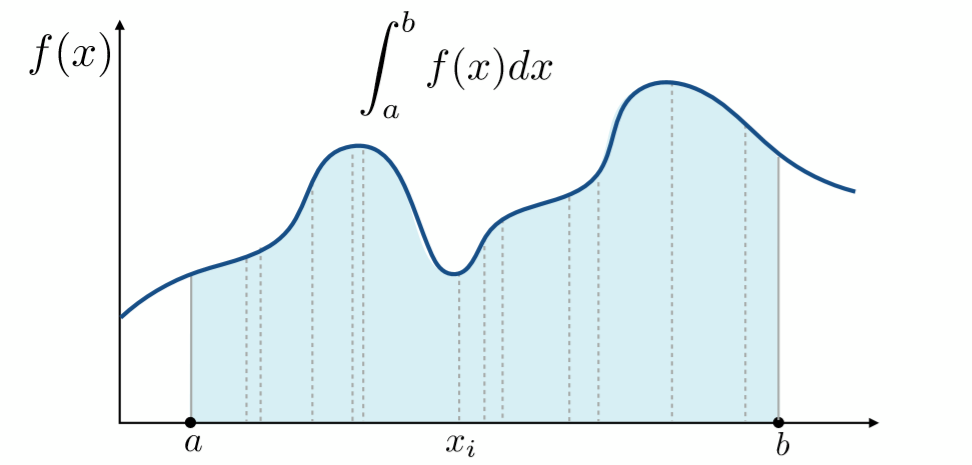

显然对于这样一个函数，很难去用一个数学式子去表示，因此无法用一般解析的方法直接求得积分值，而这时候就可以采用蒙特卡洛的思想了。

**蒙特卡洛积分的原理及做法：** 对函数值进行多次采样求均值作为积分值的近似

该做法十分容易理解，想象一下如果对上图这个函数值进行**均匀采样**的话，其实就相当于将整个积分面积切成了许许多多个长方形，然后将这些小长方形的面积全部加起来。没错，该做法其实就与黎曼积分的想法几乎一致。但蒙特卡洛积分更加的general，因为它可以指定一个分布来对被积分的值进行采样，定义如下：

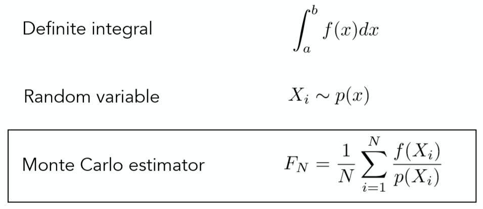

如图所示，我们希望求出一个函数f(x)在积分域[a,b]上的积分值，选定一个采样的分布p(x)，通过对该分布来进行多次的函数值采样，最后估计的值如图中最下方式子所示。

这里对该式子进行一个简单的推导。相信大家都知道，求均值的做法其实也是对期望的逼近，因此：
$$
\frac{1}{N}\sum\limits_{i=1}^N\frac{f(X_i)}{p(X_i)} ≈ E_{X~P(X)}(\frac{f(x)}{p(x)})
$$

那么对于这样一个服从某一分布的期望的计算套公式直接计算得：
$$
E_{X_i ~ p(x)}(\frac{f(X_i)}{p(X_i)}) = \int _a ^b \frac {f(x)}{p(x)}p(x)dx
\\
\\ \int _a ^b f(x)dx
$$

通过以上推导即可明白蒙特卡洛的近似正是对积分值的一个无偏估计。

但在本文中为了方便，所有的采样都使用均匀采样，因此很容易推出：

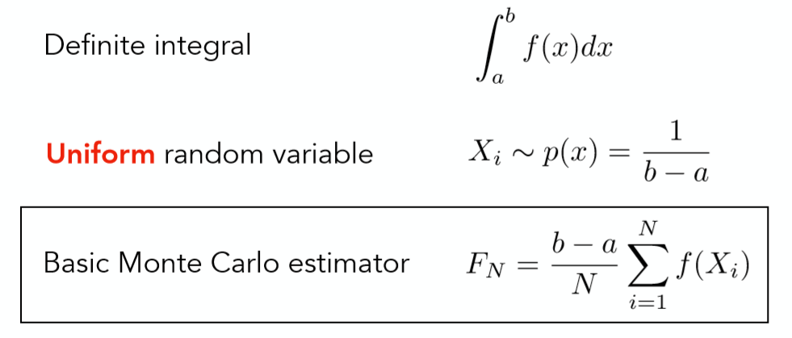

因此，**蒙特卡洛在此来说就是一个帮助求得困难积分值的方法**。

## **2 蒙特卡洛路径追踪(Monte Carlo Path Tracing)**

回顾一下上篇文章中所得到的渲染方程：
$$
L_o(p,ω_o) = L_e(p,ω_o)+\int _{Ω^+}L_i(p,ω_i)f_r(p,ω_i,ω_o)(n⋅ω_i)dω_i
$$

要想解出以上方程的解主要有两个难点：

1. 积分的计算
2. 递归形式

而解决这些难点自然就要利用上节中所提到的蒙特卡洛积分方法了。

在进入具体计算之前，对渲染方程做出一点小修改，即舍弃一下自发光项(因为除了光源其他物体不会发光), 以方便进行计算推导：
$$
L_o(p,ω_o)=\int _{Ω^+}L_i(p,ω_i)f_r(p,ω_i,ω_o)(n⋅ω_i)dω_i
$$

从具体例子出发，首先仅仅考虑直接光照：

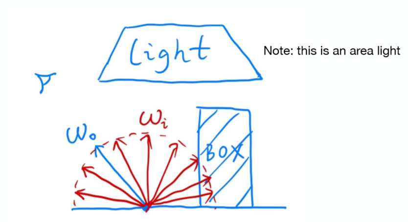

$$
L_o(p,ω_o)=\int _{Ω^+}L_i(p,ω_i)f_r(p,ω_i,ω_o)(n⋅ω_i)dω_i
$$

再次观察该修改过之后的方程其实就只是一个单纯的积分计算了，其物理含义为着色点p到摄像机或人眼的Radiance值。

回想第一章所提的，对于一个困难积分只要选定一个被积分变量的采样分布即可通过蒙特卡洛的方法得到积分结果的近似值，而此时的被积分值为$ω_i$，选定$ω_i∼p(ω_i)$，不难得出积分近似结果如下：
$$
L_o(p,ω_o) ≈ \frac{1}{N}\sum\limits_{i=1}^N \frac{ L_i(p,ω_i)f_r(p,ω_i,ω_o)(n⋅ω_i)}{p(ω_i)}
$$

正如一开始所说，先单独考虑直接光照，因此只有当采样的方向ωi击中光源的时候，光源才会对该着色点有贡献，计算伪代码如下：

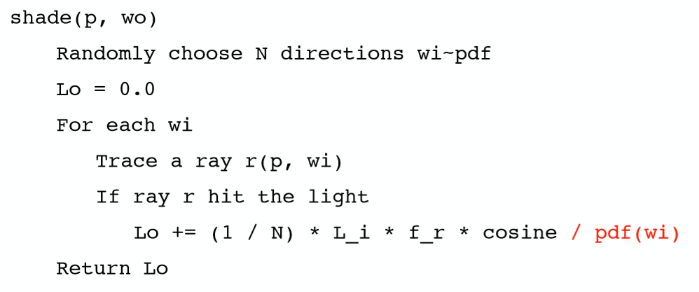

显而易见的，单独仅仅考虑直接光照自然是不够的，还需要间接光照，即当采样的ωi方向碰撞到了别的物体，如下图所示：

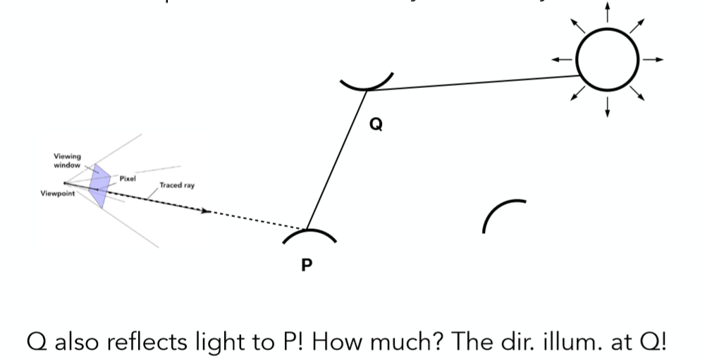

此时采样的光线碰撞到了另一个物体的Q点，那么该条路径对着色点P的贡献是多少呢？自然是在点Q的直接光照再乘上反射到该方向上的百分比了！显然这是一个类似光线追踪的递归过程，不同在于该方法通过对光线方向的采样从而找出一条条可行的路径，这也正是为什么叫路径追踪的原因，伪代码如下：

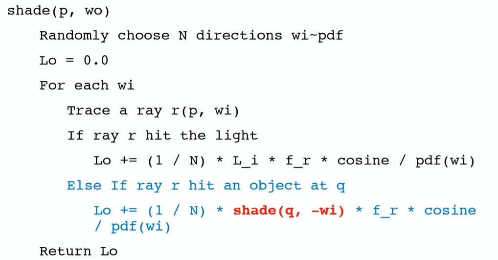

至此，我们成功通过蒙特卡洛的方式解出了渲染方程的积分值，也通过考虑直接光照与间接光照解决了递归的问题。但该方法至此有一个非常致命的缺陷：

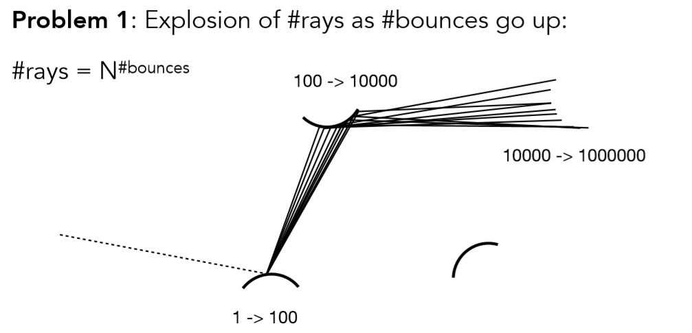

我们通过每次对光线方向的采样从而解出方程，假设每次采样100条，那么从人眼出发的第一次采样就是100条，在进行第二次反射之后就是10000条，依次类推，反射越多次光线数量便会爆炸增长，计算量会无法负担，那么如何才能使得光线数量不爆炸增长呢？**唯有每次只采样一个方向！N=1**

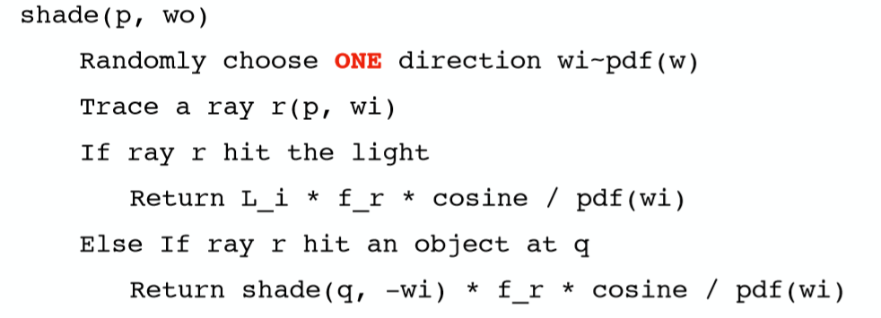

每次如果只采样一个方向那么所带来的问题也是显而易见的，积分计算的结果会非常的noisy，虽然蒙特卡洛积分是无偏估计，但样本越少显然偏差越大。但该问题很好解决，如果每次只去寻找一条路径结果不好，那么重复多次寻找到多条路径，将多条路径的结果求得平均即可！如下图所示：

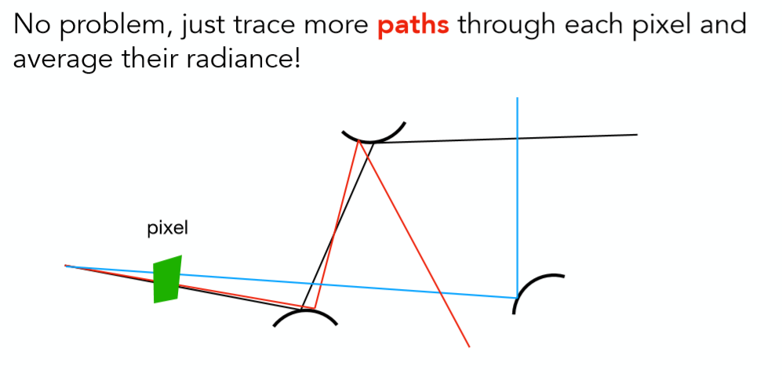

改良之后的Path Tracing伪代码如下：

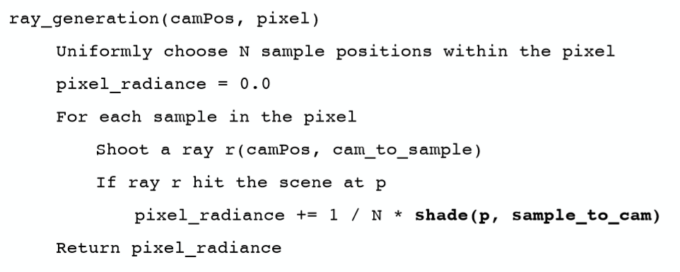

通过对经过像素的光线重复采样，每次在反射的时候只按分布随机选取一个方向，解决了只对经过像素的光线采样一次，而对反射光线按分布采样多次所导致的光线爆炸问题。

那么现在所有的问题都解决了吗？还没有！因为shade函数的递归没有出口，永远不会停下。 但这里并不没有采用类似光线追踪当中设定反射深度显示的给出递归出口的方法，而是非常精妙的采用了**俄罗斯轮盘赌(Russian Roulette)**。

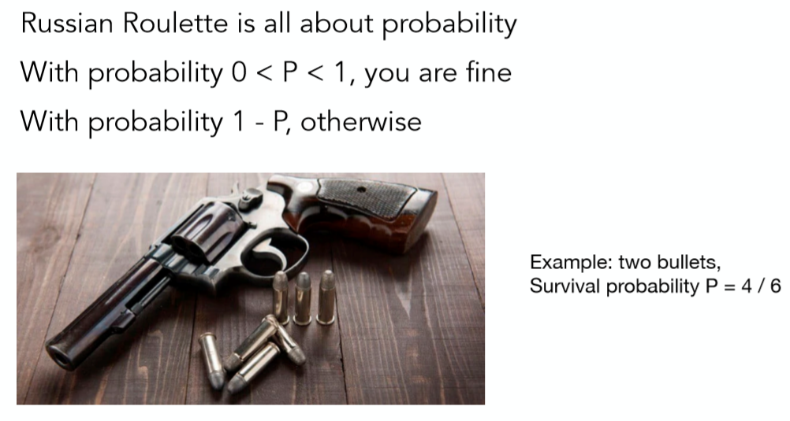

给你一把左轮，两发子弹，你不知道哪一发会真正的射出子弹，因此拿这把左轮射自己，你有4/6的概率活下来，这就是俄罗斯轮盘赌的概念。

将其应用在路径追踪当中，首先设定一个概率P, 有P的概率光线会继续递归并设置返回值为Lo/P，有1−P的概率光线停止递归，并返回0。这样巧妙的设定之下光线一定会在某次反射之后停止递归，并且计算的结果依然是无偏的，因为Radiance的期望不变，证明如下：
$$
E = P⋆(L_o/P)+(1−P)⋆0=L_0
$$

shade函数的伪代码变更如下，使得可以停止递归了：

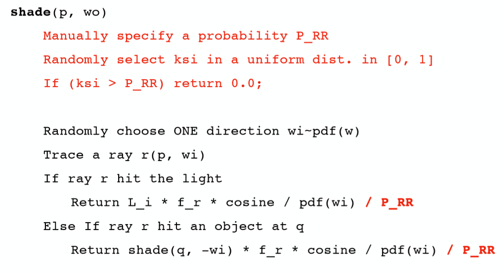

至此，我们的路径追踪算法已经完成大半，只差最后一个小问题！现在的路径追踪效率非常的低下，如图所示：

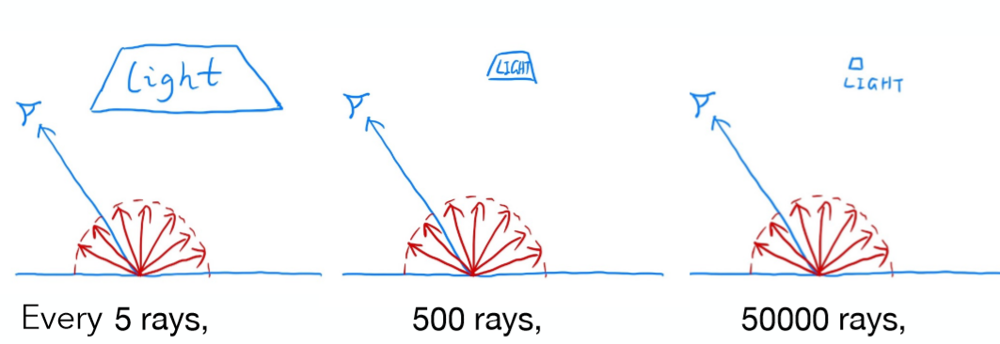

在每次计算直接光照的时候，通过均匀采样任选一个方向，但很少会的光线可以hit光源，尤其当光源较小的时候，这种现象越明显，大量采样的光线都被浪费了。

因此在计算直接光照的时候改进为**直接对光源进行采样！**这样所有采样的光线都一定会击中光源(如果中间没有别的物体)，没有光线再会被浪费了。假设光源的面积为A，那么对光源进行采样的 $pdf=1/A (因为∫pdf⁡dA=1)$，但原始的渲染方程：
$$
L_o(p,ω_o)=\int _{Ω^+}L_i(p,ω_i)f_r(p,ω_i,ω_o)(n⋅ω_i)dω_i
$$

很明显是对光线方向$ω_i$进行积分的，如果想要对光源进行采样的并依然使用蒙题卡洛的方法，那么一定要将其修改为对光源面积 dA的积分，换言之就是需要找到dA与dωi的关系即可。如下图所示：

关系式中的cosθ′是为了计算出光源上微分面积元正对半球的面积，之后再按照立体角的定义$dω=\frac{dA}{r^2}$，除以着色点x与光源采样点x'距离的平方即可。于是根据图中二者的关系可将渲染方程改写如下：
$$
L_o(x,ω_o) = \int _{Ω^+} L_i(x,ω_i)f_r(x,ω_i,ω_o)cos⁡θ d ω_i 
\\ = \int _A L_i(x,ω_i)f_r(x,ω_i,ω_o) \frac {cos⁡θcos⁡θ′}{‖x′−x‖^2}dA
$$

这样便成功从$ω_i$积分转到了对光源面积A的积分，就可以利用蒙特卡洛的方法对光源进行采样从而计算直接光照的积分值了，对于间接光照，依然采用先前的方法进行光线方向的均匀采样。最终伪代码如下，分直接光照和间接光照两部分计算：

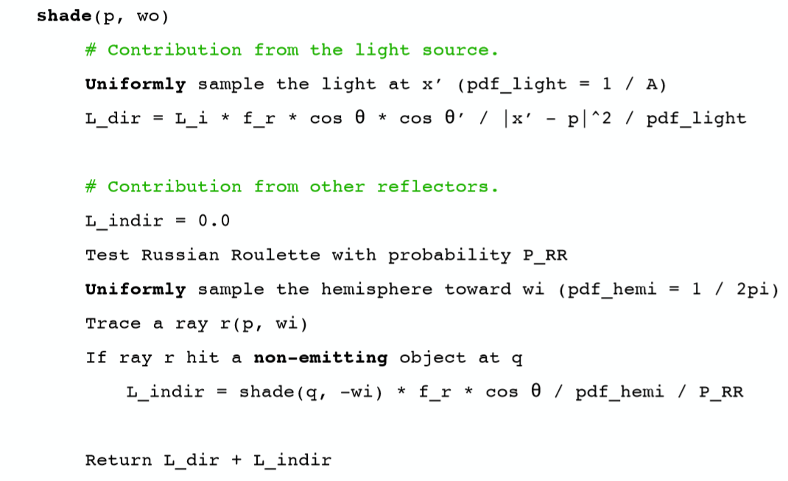

tips:计算直接光照的时候还需要判断光源与着色点之间是否有物体遮挡，该做法也很简单，只需从着色点x向光源采样点x’发出一条检测光线判断是否与光源之外的物体相交即可，如图所示:

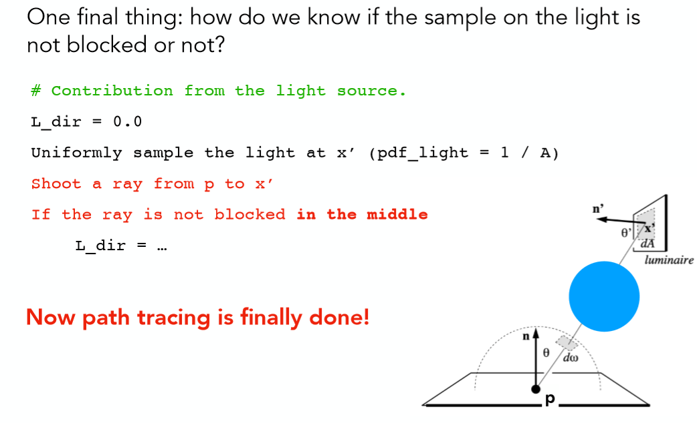