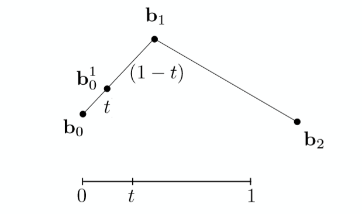
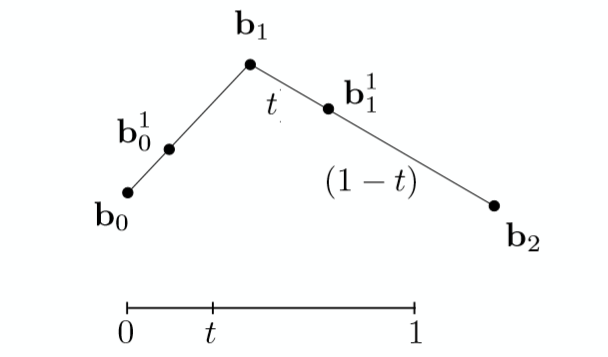
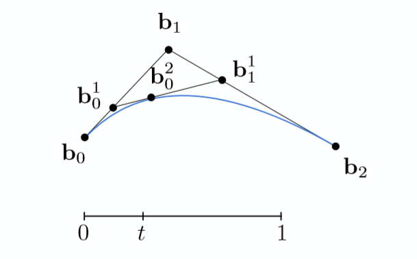
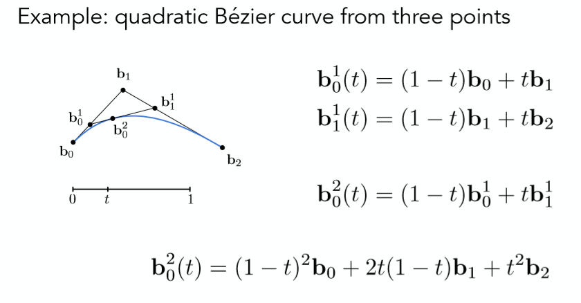
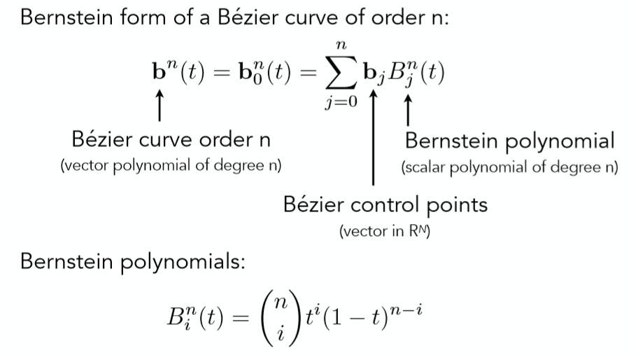
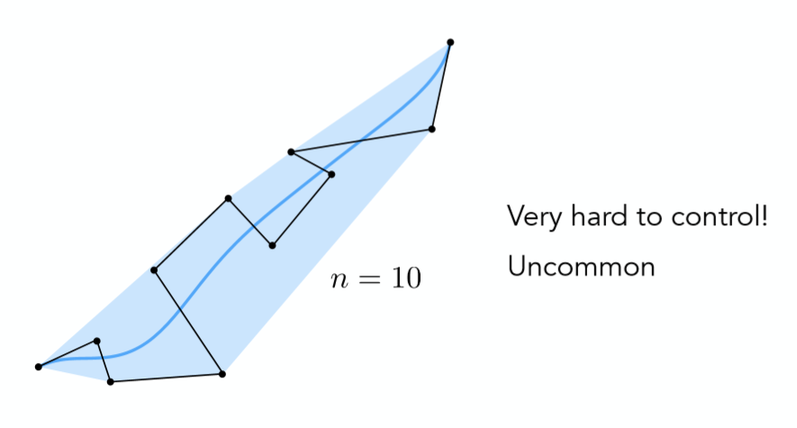
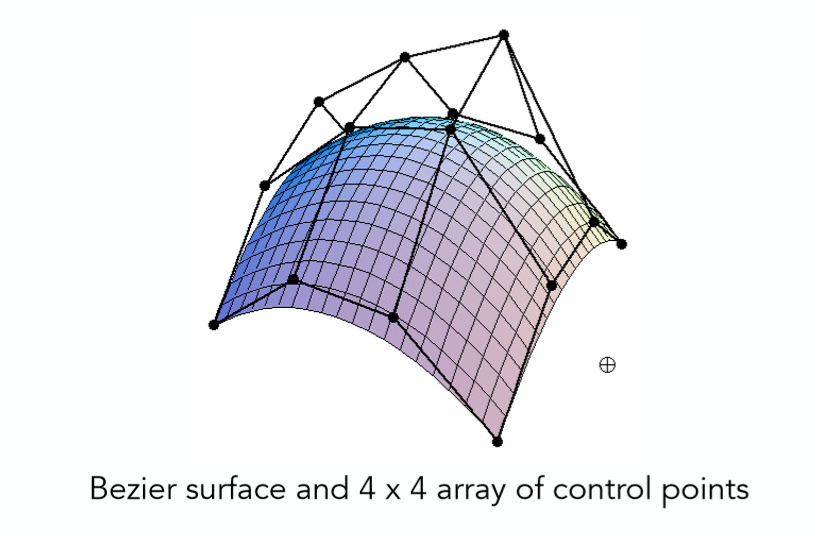

# 计算机图形学十：几何2—贝塞尔曲线(Bézier Curves)与贝塞尔曲面(Bézier Surfaces)

## **贝塞尔曲线与贝塞尔曲面**

## **1 贝塞尔曲线(Bézier Curves)**

在进入具体原理讲解之前，首先看一下一条实际的贝塞尔曲线长什么样子


其中 $p_0,p_1,p_2,p_3$为**控制点**，蓝色所表示曲线正是非常著名的贝塞尔曲线了，可以从图中观察到，曲线会与初始与终止端点相切，并且经过起点$p_0$与终点$p_3$。那么这样一条曲线究竟是怎么得到的呢？

其实贝塞尔曲线的定义很像参数方程，给定一个参数$t∈[0,1]$就能确定贝塞尔曲线上的一点，倘若取完所有t值，就能得到完整的贝塞尔曲线，了解一下大概之后，接下来我们就开始介绍计算曲线的过程。


首先从简单的3个控制点情形出发，示意如何画出曲线。 (n个控制点得到的是n-1次曲线，如图中3个控制点便是2次贝塞尔曲线)

正如一开始所说，第一步选定一个参数$ t∈[0,1]$，在$b_0b_1$线段之上利用t值进行线性插值:



即$b_0^1=b_0+t∗(b_1−b_0)$，得到$ b_0^1$ 之后在$b_1b_2$线段上重复做相同的线性插值得到点$b_1^1$:



通过给点参数 t 计算得到点$ b_0^1,b_1^1$之后将两点连接，相信许多读者都能猜到下一步是什么了，没错就是在$b_0^1b_1^1$线段之上再进行一次线性插值！



如此便成功获得了如图所示的3个控制点之下的2次贝塞尔曲线上的一点$ b_0^2$ 了，那么对所有的$t∈[0,1]$都重复上述的过程，就可以得到上图所示的蓝色贝塞尔曲线了。通过这样一个简单的3个控制点的例子，相信很快就能理解贝塞尔曲线的原理，那么对于4个控制点，5个控制点，乃至任意控制点步骤都是类似的。

**其核心所在就是多次的线性插值，并在生成的新的顶点所连接构成的线段之上递归的执行这个过程，直到得到最后一个顶点**

如下图这样一个4个控制顶点的例子，步骤完全类似:


那么我们为何称由n个控制点的贝塞尔曲线为n-1次呢？同样以一开始的3个控制点为例，将贝塞尔曲线方程完全展开看看



```glsl
vec2 fixUV(in vec2 c){
    return 2. * (2.*c - iResolution.xy) / min(iResolution.x, iResolution.y);
}

float Circle(in vec2 p, in vec2 c){
    float d = length(p-c);
    return smoothstep(fwidth(d), 0., d-0.02);
}

float Line(in vec2 p, in vec2 a, in vec2 b) {
    vec2 pa = p-a, ba = b-a;
    float t = clamp(dot(pa, ba)/dot(ba,ba), 0., 1.);
    vec2 c = a+ba*t;
    float d = length(c-p);
    return smoothstep(fwidth(d), 0., d-0.001);
}

vec2 Bizier(in vec2 A, vec2 B, vec2 C, float t) {
    vec3 col = vec3(0.);
    vec2 AC = mix(A, C, t);
    vec2 CB = mix(C, B, t);
    vec2 Bi = mix(AC, CB, t);

    return Bi;
}

void mainImage(out vec4 fragColor, in vec2 fragCoord) {
    vec2 uv = fixUV(fragCoord);

    vec3 col = vec3(.1, .1, .1);

    float t = sin(iTime) * 0.5 + 0.5;

    // 贝塞尔起始点，结束点，控制点（用鼠标控制），AC线性差值t点，CB线性差值t点, 
    vec2 A = 
        vec2(-0.9, -0.9),
        B = vec2(0.7, 0.8),
        C = fixUV(iMouse.xy),
        AC = mix(A, C, t),
        CB = mix(C, B, t),
        Bi = mix(AC, CB, t);
    col += vec3(0.8, 0.2, 0.4)*Circle(uv, A);
    col += vec3(0.3, 0.1, 0.8)*Circle(uv, B);
    col += vec3(0.3, 0.9, 0.1)*Circle(uv, C);
    col += vec3(0.9, 0.4, 0.1)*Circle(uv, AC);
    col += vec3(0.1, 0.5, 0.8)*Circle(uv, CB);
    col += vec3(0.9, 0.1, 0.)*Circle(uv, Bi);

    col += vec3(0.1) * Line(uv, A, C);
    col += vec3(0.1) * Line(uv, C, B);
    col += vec3(0.1) * Line(uv, AC, CB);

    int NUM_SEGS = 50;

    vec2 p, pp = A;
    for (int i=1; i<NUM_SEGS;i++){
        t = float(i)/float(NUM_SEGS);
        p = Bizier(A, B, C, t);
        col += vec3(0.9, 0.2, t)*Line(uv, p, pp);
        pp = p;
    }

    fragColor = vec4(col, 0.3);
}

```


其实看到这就已经非常清楚了，最终得到的贝塞尔曲线方程恰好就是一个关于参数 t 的二次方程，如果细心观察的话，其实可以发现控制点的系数是非常有规律的，很像二项系数，因此可以总结规律得到一个任意控制点组成的贝塞尔曲线的方程如下:



对于这样一个特殊系数其实也有一个多项式与之对应，正是伯恩斯坦多项式，其定义如图中下方所示。

好了至此就是贝塞尔曲线原理的所有内容了，相信显现在对于任意的控制点，都能很快的画出对应的曲线，最后我们对贝塞尔曲线的几点性质做一个概括:

**1 必定经过起始与终止控制点**

**2 必定经与起始与终止线段相切**

**3 具有仿射变换性质，可以通过移动控制点移动整条曲线**

**4 凸包性质，曲线一定不会超出所有控制点构成的多边形范围**

回想一下PS等具有画图功能的软件中的钢笔工具所运用的便是贝塞尔曲线了，除了这个例子之外许多字体或是矢量图都广泛运用了贝塞尔曲线。但对于高阶贝塞尔曲线它有一个严重的缺陷:



对于上图所示的由11个控制点所得到的10次贝塞尔曲线，由于控制点众多，很难控制局部的贝塞尔曲线形状，因此为了解决该问题，有人提出了分段贝塞尔曲线，即将一条高次曲线分成多条低次曲线的拼接，其中用的最多的便是用很多的3次曲线来拼接，如下图:


(注：上图是一个贝塞尔曲线的**[网页demo](https://link.zhihu.com/?target=http%3A//math.hws.edu/eck/cs424/notes2013/canvas/bezier.html)**，有兴趣读者可以去玩玩) 如果想要使得拼接的点看起来较为光滑的话，就要满足一些连续条件如一阶连续(连接点导数的左右极限相等)，二阶连续等等，这些都是高数的基础知识，在此不多做赘述。

对于本文来说，贝塞尔曲线到这里就已经讲解完毕了，但其实除了贝塞尔曲线之外还有B样条曲线，NURBS曲线等等。简单说两句

**B样条曲线相对于贝塞尔曲线可以更好的进行局部控制** **NURBS（非均匀有理B样条）曲线可以得到一些B样条曲线无法精准描述的圆锥曲线，如下图:**


相对于贝塞尔曲线来说，这两种曲线更加深入与复杂，读者可以自行收集资料，本文不作过多展开

## **2 贝塞尔曲面(Bézier Surfaces)**




其实在理解了贝塞尔曲线之后，贝塞尔曲面的原理也是十分容易理解的了，无非是一个从2维到3维的过渡。

如果说对于曲线来说只有一个参数 t∈[0,1]那么对于一个面来说，就应该有两个参数，分别设 u∈[0,1]，v∈[0,1]，具体过程如下图所示:


首先规定一共4x4 = 16个控制点，其水平面位置如图中16个黑点所示(并未表示出高度，防止图形太乱)，将这16个点分成4列，图中红色圈中的为一列的具体例子。

**第1步 在这4个控制点之下利用第一个参数 u 运用第一章的计算贝塞尔曲线的方法得到蓝色点，因为有4列，所以一共可以得到如图所示的4个蓝色点。(灰色曲线分别为每列4个点所对应的贝塞尔曲线)**

**第2步 在得到4个蓝色顶点之后，在这四个蓝色顶点的基础之下利用第二个参数 v 便可以成功得出贝塞尔曲面上的正确一点**

**第3步 遍历所有的 u，v值就可以成功得到一个贝塞尔曲面**

到这里整个几何部分的大部分内容就已经讲解完毕了，做个预告，在下篇笔记也是几何的最后一部分我们会去介绍细分曲面的相关知识