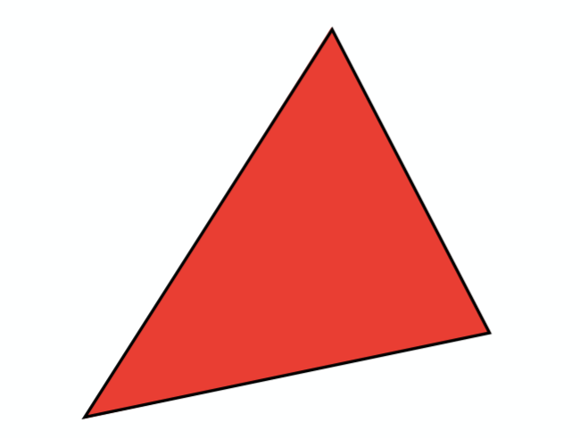
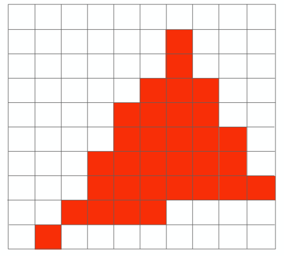
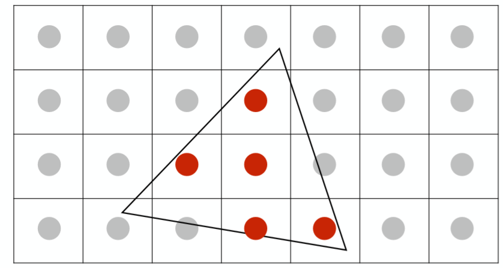
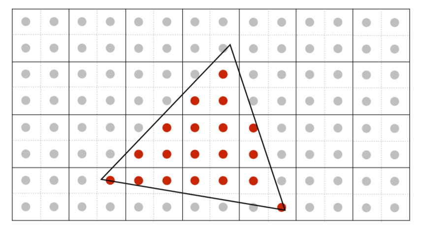
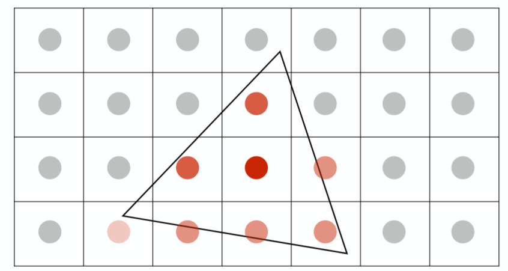
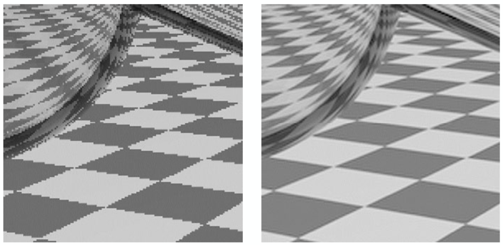
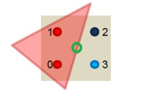
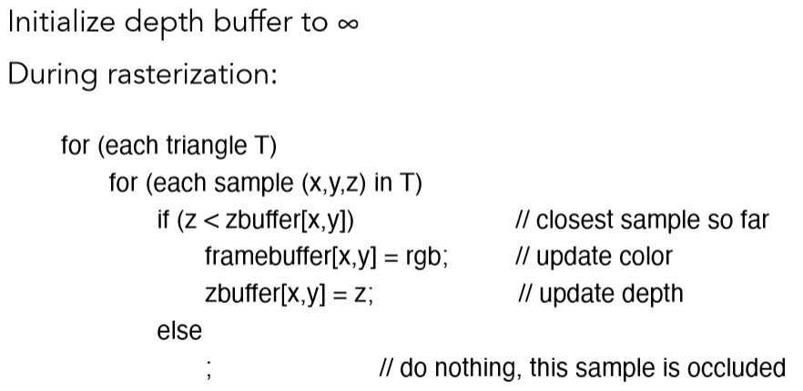
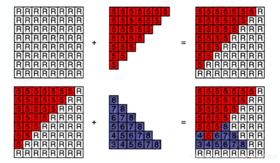
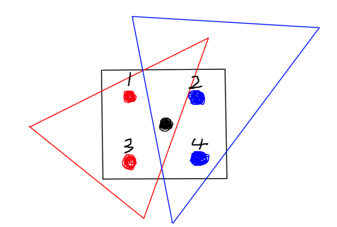

# 计算机图形学四：抗锯齿SSAA及MSAA算法和遮挡剔除Z-Buffer算法

## **抗锯齿算法和Z-Buffer算法**

在通过上一节的讲解之后，我们已经能够成功的把带有几何意义的顶点信息从虚拟3维世界之中转换到用**像素表示的2维屏幕之中**，那这样真的已经足够了吗？本节我们看看还有哪些问题需要进一步解决。

## **1 锯齿 (走样，Aliasing)**

利用上一节的三角形光栅化算法之后，我们可以把该三角形表示成一个如下图所示的像素点集合

对！发现问题了没有？ 三角形变的“歪歪扭扭”的，哪能说它是一个标准的三角形呢。这种问题本质是因为我们在采样的时候的频率过低无法跟上图像的频率，导致最后结果的失真，当然这是从信号处理的角度去看这个问题，在这里不会做过多的展开。 从简单的角度去解释这种问题出现的原因就是，**我们用有限离散的像素点去逼近连续的三角形**，那么自然会出现这种锯齿走样的现象，因为这种近似是不准确的。接下来会介绍两种解决走样的方法，具体来说第二种可以当成第一种的改良

## **1.1 超采样反走样(Super Sampling AA)**

SSAA的想法其实是非常直观的，如果有限离散像素点逼近结果不好，那么我们用更多的采样点去逼近不就会得到更好的结果了吗？所以根据这个思想我们可以把原来的每个像素点进行细分，比如下例中，我们讲每个像素点细分成了4个采样点：

我们根据每个采样点来进行shading（该概念还未提及，可以理解为计算每个像素点的颜色的过程，当然这里是一个纯红色的三角形，如果该点在三角形内，它的颜色值可以直接得到为（1，0，0）），这样得到了每个采样点的颜色之后，我们讲每个像素点内部所细分的采样点的颜色值全部加起来再求均值，作为该像素点的抗走样之后的颜色值！结果如下：

当然读者可能还是觉得，这还不是有锯齿，咋就抗锯齿了呢？

仔细观察可以发现因为将4个采样点的颜色求均值的之后，靠近三角形边缘的像素点有的变淡了，从宏观角度来看的话，这个锯齿就会变得不那么明显了。我们可以看看这样一个具体例子。

怎么样，效果还是相当明显吧！

(tips：SSAA并不局限于分成4个，也可以分更多的，可以自己决定，如果喜欢玩游戏的读者一定知道游戏里面其实就有一个抗锯齿的选项，其中的 ×2,×3,×4,分别代表的就是4个，9个，16个采样点，显然采样点越多抗锯齿效果越好，但计算负担也会随之增加）。

## **1.2 多采样反走样(Multi-Sampling AA)**

MSAA其实是对SSAA的一个改进，显然SSAA的计算量是非常大的，每个像素点分成4个采样点，我们就要进行4次的shading来计算颜色，额外多了4倍的计算量，如何降低它呢？

MSAA的做法也很容易理解，我们依然同样会分采样点，但是只会去计算究竟有几个采样点会被三角形cover，计算颜色的时候只会利用像素中心坐标计算一次颜色(即所有的信息都会被插值到像素中心然后取计算颜色)，如下图：

只有两个采样点被我们的三角形cover了，将该像素中心计算出来的颜色值乘以50%即可，这样大大减少了计算量，不必对每个子采样点都进行着色计算，并且得到反走样效果也是很不错的。

## **2 Z-Buffer算法**

解决了走样问题之后，还有一个仍需解决的问题，我们如何判断物体先后关系？更具体的说每个像素点所对应的可能不止一个三角形面上的点，我们该选择哪个三角形面上的点来显示呢？答案显然易见，离摄像头最近的像素点显示。这里便要利用到我们之前做model−view−projection变换之后所得到的深度值 z 了，这里定义z越大离摄像机越远！

以下我们介绍Z-Buffer算法，主要有2步。

**1. Z-Buffer算法需要为每个像素点维持一个深度数组记为zbuffer，其每个位置初始值置为无穷大（即离摄像机无穷远）。**

**2. 随后我们遍历每个三角形面上的每一个像素点[x,y]，如果该像素点的深度值z，小于zbuffer[x,y]中的值，则更新zbuffer[x,y]值为该点深度值z，并同时更新该像素点[x,y]的颜色为该三角形面上的该点的颜色。**

没错，根据上述两个步骤，我们就已经能够成功得到正确遮挡顺序的结果了，伪代码如下:

一个计算实例如下：

如果一下子不能反应过来，建议利用该实例推一边应该就能明白了。

**好了，整套笔记到目前位置，我们已经解决大部分光栅化的问题了，接下来就是如何真正的计算每个三角形面上点的颜色了(shading)！该部分内容会在之后的笔记中给出。**

tips:这里的MSAA说的有些简单，实际操作的时候，同样会维护所有子采样点的color buffer和depth buffer，每次对pixel中心计算shading的时候，会根据depth值(因为可能不止一个三角形拥有这个像素)和三角形覆盖关系判断是否把颜色值写入。 如下面这个例子(灵魂画手见谅)

红色和蓝色三角形同时覆盖了黑色的像素中心，那么在第一次渲染红色三角形的时候会将颜色写入1,3号采样点，同时更新depth buffer，但此时2,4号采样点的depth buffer依然是无穷(初始值)，所以在渲染到蓝色三角形的时候会将蓝色写入2,4号并更新depth buffer(可认为子采样点的深度值由像素中心的深度值代替，也可通过重心插值算出精确值)。

如果还有更多的三角形覆盖黑色像素中心的话，会重复上述这个过程，即根据是否覆盖以及深度值判断是否写入颜色值。最后将这4个子采样点颜色平均即可。

个人感觉这种MSAA的效果是没有SSAA好的，因为MSAA相当于默认了采样点的颜色与像素中心差别不大，导致了误差的存在，特别是在纹理映射的时候，如果纹理过大，MSAA可能完全没啥效果，因为一个屏幕空间像素覆盖了多个纹理空间像素，屏幕空间像素内微小的采样点距离差距都会导致在纹理空间中完全不一样的颜色信息，如果还是只做一次屏幕空间像素中心的shading的话，误差就会非常大。

时域的卷积 = 频域的乘积