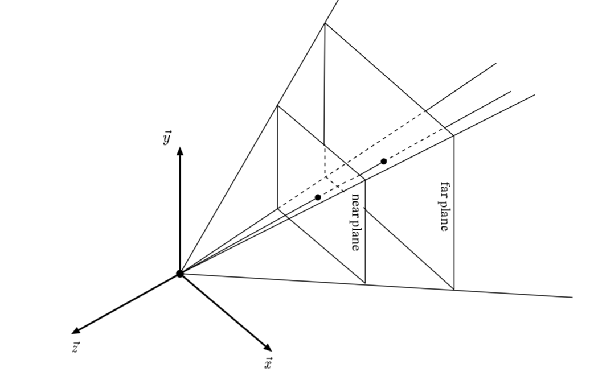

# 计算机图形学补充2：齐次空间裁剪(Homogeneous Space Clipping)

## **齐次空间裁剪**

齐次空间裁剪是指发生在vertex shader之后，透视除法( 顶点坐标/w )之前的一段操作。其目标非常直接，因为我们并没有必要去渲染视锥体之外的物体，如下图：


只有位于视锥体之内的部分，我们才需要去光栅化该三角面，因此裁剪就是将所有不在视锥体之内的三角面进行剔除的一个过程，而齐次空间裁剪则是将这个过程在四维的齐次空间进行。


## **1 简单裁剪及其缺陷**

首先举一个非常直观的裁剪方法，假设现在所有的顶点都已经经过的model，view，perspective 和 透视除法的操作，那么我们的视锥体的三维空间范围应该转化为了$ [−1,1]×[−1,1]×[−1,1] $的三维标准立方体范围，此时检查每一个顶点的坐标，如果有任意一维超出了标准立方体的范围，则将这个顶点所属的三角面完全剔除。

这种方法的优点是简单直观并且效率很高，在早期硬件性能较低的时候有不少的游戏制作确实采用了这种方法。但其缺点也是非常明显的，如果一个三角形并不是完全在标准立方体之外的话(即一部分在内，一部分在外)，那么将这个三角形面完全剔除似乎并不是一种合理的方法，其得到裁剪的效果如下：


仔细观察琪亚娜的脑壳和底边的衣物，有许多突兀的缺损一部分的情况，而这正是简单裁剪的问题，我们希望得到的裁剪结果在边缘应该是平滑的，如下图所示，从单个三角面的角度考虑：


三角形ABC是待被裁剪的三角面，plane是裁剪平面(横截面角度观察)，plane左边为外侧，右边为内侧，我们希望保留内侧部分，如果按照简单裁剪的方法，由于点A位于裁剪平面外侧，则整个三角面都会被抛弃。正确的做法应该是求出CA，AB与裁剪平面plane的交点P1，P2。并将$P_1,P_2,B,C$重新组合成2个新的三角面，即$P_1P_2 B $和$ P_1BC$，接下来就会一步步去具体介绍如何达到这种效果。

## **2 齐次空间裁剪**

## **2.1 点与面的关系判断**

想要进行三角面的裁剪，重要的是能够正确判断三角面的裁剪空间的位置关系，而三角面与裁剪空间的位置关系是由构成三角面的边与裁剪空间的关系决定的，更进一步，边与裁剪空间的关系则是由构成这条边的两个顶点与裁剪空间的关系决定的。

理清上面的逻辑，我们所要做的第一步便是判断点与裁剪空间的关系(即点在内部还是外部)，不过这里做一个小小的简化，先不直接考虑点与裁剪空间的关系，而是考虑点与单一裁剪平面的关系(这其实是判断与裁剪空间关系的基础，后文会做详细解释)。


如上图所示，依然从横截面去观察裁剪平面与点。一个平面可由一个平面上的点P和法线向量$\vec{n}$决定，此时平面上任意一点 P′满足$(P′−P)⋅\vec{n}=0$。且法线所指的一半空间为外侧，另一半空间为内侧，任给一点Q不难得出：

**1 如果$(Q−P)⋅\vec{n}>0$，则点Q在裁剪平面外侧**

**2 如果$(Q−P)⋅\vec{n}=0$，则点Q在裁剪平面上** (一般不考虑这种特殊情况)

**3 如果$(Q−P)⋅\vec{n}<0$，则点Q在裁剪平面内侧**

现在我们已经知道了如何判断任给一点与裁剪平面的关系了，按照本小节开头所提到的，接下来应该通过点与裁剪平面的关系去判断线与裁剪平面的关系了。

## **2.2 线与面的关系判断和求交点**


其实有了点与裁剪平面关系判断的基础之后，线与平面的关系判断已经十分直观了。如上图所示，裁剪平面定义与 2.1节中一致，任取一条线段，其两顶点为$Q_1$和$Q_2$，设$d_1=(Q_1−P)⋅\vec{n}，d_2=(Q_2−P)⋅\vec{n}$ 。($d_1,d_2$的几何含义为向量在法线上带符号的投影距离)。不难得出：

**1 如果$d_1>0,d_2>0$，则边$Q_1Q_2$完全处于裁剪平面外侧**

**2 如果$d_1<0,d_2<0$，则边$Q_1Q_2$完全处于裁剪平面内侧**

**3 如果$d_1∗d_2<0$，则边$Q_1Q_2$与裁剪平面相交与点I**

当边与裁剪平面相交时，我们需要求出交点I(因为此交点 **可能** 在之后帮助构成新的三角形)，计算过程易得如下：

$I=Q_1+t(Q_2−Q_1)$

其中$ t=|Q_1I|/|Q_1Q_2|=d_1/(d_1−d_2) $(这里利用了一下三角形相似性质)

有了以上的基础之后，便能更进一步进行任意凸多边形与单一裁剪平面的剪裁了！

## **2.3 凸多边形与面的剪裁**

对于任意凸多边形，只需逐边遍历，判断边与裁剪平面的关系，有必要时求出交点，并保留所有在平面内侧的顶点即可，思路非常直接，这里直接给出伪代码实现参考(可以随便设计一个例子，过一遍代码流程就能清楚的理解了)。

```cpp
//clip_plane为裁剪平面的自定义结构体，vert_list存储了待裁剪凸多边形的所有顶点
//num_vert为顶点个数，in_list为需要保留下来的裁剪平面内侧顶点的列表
static int clip_with_plane(clip_plane c_plane, vec3* vert_list, int num_vert, vec3* in_list)
{
 int i;
 int in_vert_num = 0;
 int previous_index, current_index;
 
 for (i = 0; i < num_vert; i++)
 {
  //从最后一个点开始，遍历所有边
  current_index = i;
  previous_index = (i - 1 + num_vert) % num_vert;
  vec3 pre_vertex = vert_list[previous_index]; //边的起始点
  vec3 cur_vertex = vert_list[current_index];  //边的终止点

  float d1 = cal_project_distance(c_plane, pre_vertex );
  float d2 = cal_project_distance(c_plane, cur_vertex );
  
  //如果该边与裁剪平面有交点，则计算交点并存入in_list
  if (d1 * d2 < 0)
  {
   float t= get_intersect_ratio(pre_vertex,cur_vertex,c_plane); //求出t值
   vec3 I = vec3_lerp(pre_vertex,cur_vertex,t);
   in_list[in_vert_num] = I;
   in_vert_num++;
  }
  
  //如果终止点在内侧，直接存入in_list
  if (d2 < 0 )
  {
   in_list[in_vert_num] = cur_vertex ;
   in_vert_num++;
  }
 }

 return in_vert_num;
}
```

tips: 这里给出的伪代码只计算了交点的顶点坐标。同理uv坐标，法向向量等属性值可以插值得到，读者可以根据自己实现的软件渲染器做相应更改即可。

## **2.4 凸多边形与视锥体的剪裁**

在2.3节介绍了如何将一个凸多边形与一个单一平面进行裁剪并保留内侧顶点的过程，可这与一开始的目标却是不同的，我们希望的是将一个凸多边形(三角面)与一个三维的空间进行裁剪，更准确的说是与视锥体进行裁剪，该如做到后者呢？这其实是非常直观的，正如在2.1小节提到的与单一平面进行裁剪是与空间进行裁剪的基础，做法如下：



如上图所示的一个视锥体由6个平面组成，分别为：

**top plane: 经过点P(0,0,0)，法线为$\vec{n}=(0,cos\frac{α}{2},sin\frac{α}{2})$**

**bottom plane: 经过点P(0,0,0)，法线为$\vec{n}=(0,−cos\frac{α}{2},sin\frac{α}{2})$**

**left plane: 经过点P(0,0,0)，法线为$\vec{n}=(−cos\frac{α}{2},0,sin\frac{α}{2})$**

**right plane: 经过点P(0,0,0)，法线为$\vec{n}=(cos\frac{α}{2},0,sin\frac{α}{2})$**

**near plane: 经过点P(0,0,-n)，法线为$\vec{n}=(0,0,1)$**

**far plane: 经过点P(0,0,-f)，法线为$\vec{n}=(0,0,−1)$**

其中，n,f分别为近投影平面，和远投影平面的距离,α为fov的大小。法线推导较为容易，这里省略了。

对于这样一个由6个平面组成的视锥体进行裁剪，只需依次以每一个面进行裁剪，并且前一次裁剪的输出为下一次裁剪的输入即可。参考伪代码如下：

```cpp
clip_with_plane(top_plane, vert_list, num_vert, in_list)
//对top_plane裁剪得到的in_list，为下一步对bottom裁剪的输入,依次类推
clip_with_plane(bottom_plane, in_list, num_vert, in_list2)
clip_with_plane(left_plane, in_list2, num_vert, in_list3)
clip_with_plane(right_plane, in_list3,  num_vert, in_list4)
clip_with_plane(near_plane, in_list4, num_vert, in_list5)
clip_with_plane(far_plane, in_list5, num_vert, in_list6)
```

(这里的代码以为了方便理解优先，不代表最终实现)

最终得到的in_list6 就是在视锥体范围之内的所有顶点了，不过到目前为止虽然看起来已经完成了剪裁所有过程(还少一个把顶点重新装配为三角面的过程)，但是并没有和齐次空间有多大的关联，别急，下面一节我们便将所有的步骤转化到齐次空间进行。

## **2.5 齐次坐标下的裁剪**

齐次坐标指由(x,y,z,w)构成的四维坐标，其一般由世界坐标系下的顶点坐标经过model，view，perspective变换得到，在此基础之上再进行一步透视除法/w，那么原视锥体所对应的空间就会变为$[−1,1]×[−1,1]×[−1,1] $的标准立方体。

显然，此时的6个平面分别为y=1,y=−1,x=1,x=−1,z=1,z=−1，根据2.4节的方法，可以得到被标准立方体裁剪过后的内侧的顶点集合，完成裁剪过程。

但实际上，并不需要进行透视除法再进行裁剪，完全可以在齐次空间这样一个四维空间下找出6个需要裁剪的超平面即可。那么现在的问题就转化为，找到4维齐次空间下，对应y=1,y=−1,x=1,x=−1,z=1,z=−1的6个超平面，再直接进行裁剪。

假设一个点P(x,y,z,w)是属于裁剪空间内部的，那么经过透视除法之后，应该满足如下几个不等式：
$$
−1<=x/w<=1
\\−1<=y/w<=1
\\−1<=z/w<=1
$$


那么这3个不等式的6个边界，其实也就对应了我们想要的4维齐次空间下的6个平面了，即：
$$
w=y,w=−y,w=x,w=−x,w=z,w=−z
$$


好了，现在得到了想要的平面，那么对四维空间下对平面的裁剪其实完全与三维空间中是一致的，只要找出能够做到如下两点方法即可：

**1 需要能够判断点与面的关系，即内侧还是外侧，并可以借此进一步推断边与面的关系**

**2 倘若边与平面相交，需要能够求出边与平面的交点，即插值系数t**

首先看第一点，这其实已经由上文的3个不等式已经给出了，如果满足对应的不等式则就处于对应平面的内侧，否则就在外侧。 再看第二点，我们以w=x平面为例(其它平面可以类推得到)，假设边Q1Q2与该平面交点为I，插值系数为t，作图如下：


(横轴可以代表x或y或z，图中代表x) 此时 I=Q1+t(Q2−Q1)，又该交点在w=x平面上，则点I坐标的第一维与第四维应该相等，列出如下式子并计算出t得：
$$
w_1+t(w_2−w_1)=x_1+t(x_2−x_1)
\\t=\frac{w_1−x_1}{(w_1−x_1)−(w_2−x_2)}
$$


最终只需要把三维空间内对平面裁剪的伪代码当中关于 判断点与平面的关系，边是否与平面相交以及求得插值系数t的部分替换为上文刚刚所讲述的方法，即可得到完整的齐次空间裁剪的伪代码，这里就不再重写一遍了。

tips： 除了对$w=y,w=−y,w=x,w=−x,w=z,w=−z$裁剪之外，一般还会在之前再增加一个$w=1e−5$平面的裁剪(只要是一个极小数即可，并不一定要是1e-5)，该举措的目的是只保留下$w>1e−5$的点，防止裁剪之后的透视除法阶段出现除0错误。

## **2.6 三角形组合(triangle assembly)**

经过以上所有步骤裁剪之后，得到的是所有再裁剪空间内部的顶点，我们需要的是将这些顶点重新组合成1个或多个三角形面，再输入光栅化渲染管线。这里实现方法较为直观，直接给出伪代码(关注后半部分即可)：

```cpp
void draw_triangles(unsigned char* framebuffer, float *zbuffer, PhongShader& shader,int nface)
{
 int i;
 //vertex shader
 for (i = 0; i < 3; i++)
 {
  shader.vertex_shader(nface, i);
 }

 //homogeneous clipping
 int num_vertex = 3;
 num_vertex = clip_with_plane(W_PLANE, vert_list, num_vertex , in_list1);
 num_vertex = clip_with_plane(X_RIGHT, in_list1, num_vertex , in_list2);
 num_vertex = clip_with_plane(X_LEFT,  in_list2, num_vertex , in_list3);
 num_vertex = clip_with_plane(Y_TOP, in_list3, num_vertex , in_list4);
 num_vertex = clip_with_plane(Y_BOTTOM, in_list4, num_vertex , in_list5);
 num_vertex = clip_with_plane(Z_NEAR, in_list5, num_vertex , in_list6);
 num_vertex = clip_with_plane(Z_FAR, in_list6, num_vertex , in_list7);
 
 //triangle assembly
 for (i = 0; i < num_vertex - 2; i++) {
  //构成三角面的3个顶点索引
  int index0 = 0;
  int index1 = i + 1;
  int index2 = i + 2;
  
  vec4 clipcoord_attri[3];
  clipcoord_attri[0] = in_list7[index0];
  clipcoord_attri[1] = in_list7[index1];
  clipcoord_attri[2] = in_list7[index2];

  rasterize_triangle(clipcoord_attri, framebuffer,zbuffer,shader);
 }
}
```

(这里的代码以为了方便理解优先，不代表最终实现)

同样的，如果读者对代码有些疑问，可以找一个具体的例子从齐次剪裁开始走一遍流程即可。

齐次空间裁剪与简单裁剪效果对比：


看看脑壳和下面，差别还是挺明显的！

tips： 有一点需要注意的是，在三角形重新组合的时候，组合的顶点顺序往往是很重要的，一般与原三角形顶点顺序保持不变(如原来是逆时针存储顶点，现在还是逆时针重新组合)，这是为了在背面剔除的时候不受影响。关于这一点，以上给出的伪代码已经考虑到了，包括裁剪过程中存入in_list的顺序，和重新组合三角形的方法。

## **3 总结**

以上就是关于齐次空间裁剪的全部内容了，写的略微有些冗杂，但是也算是把每一个小步骤都给讲出来了。核心就是求得需要保留下来的顶点集合，再重新组合成新三角形即可。